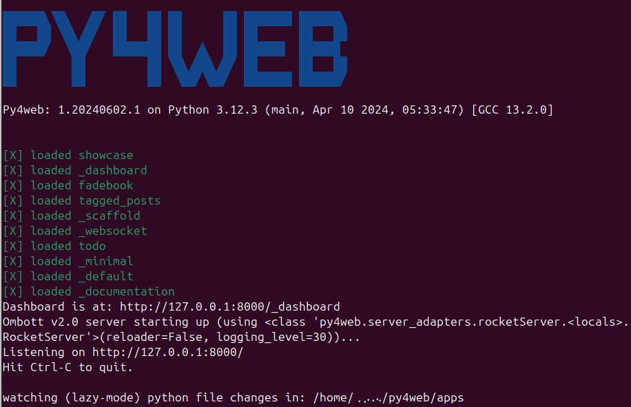
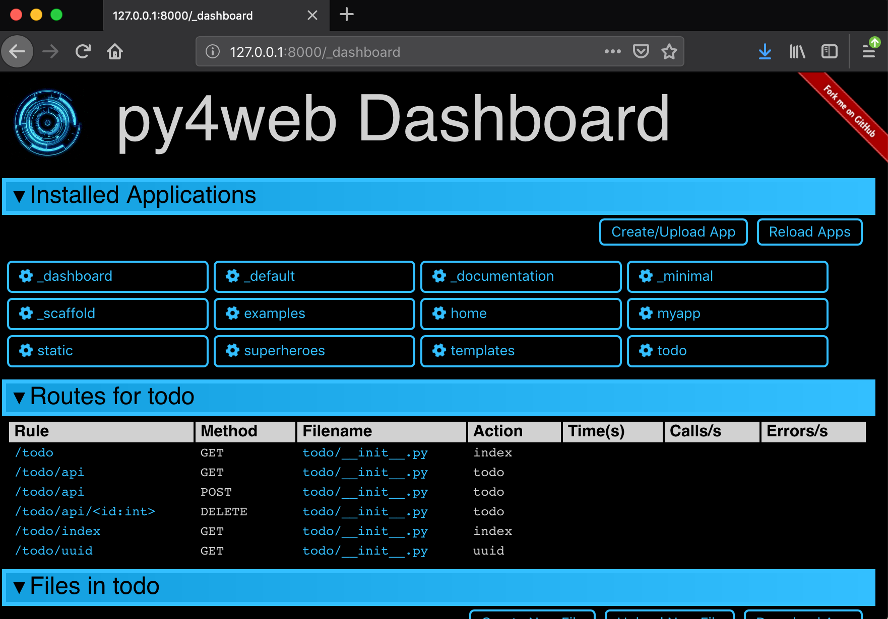
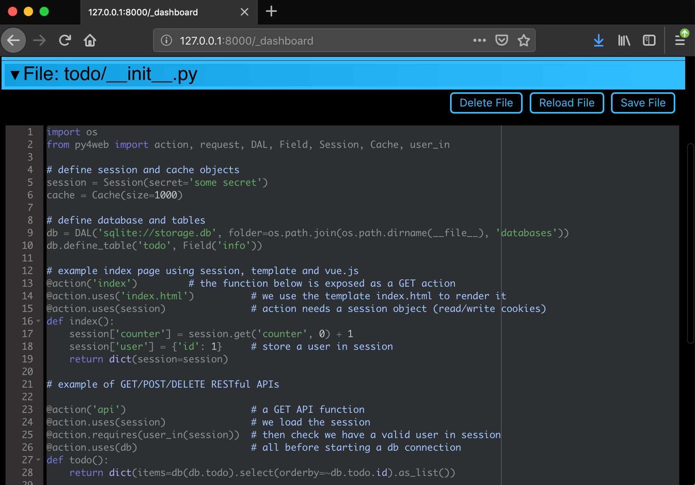

What is py4web?
===============

.. image:: https://travis-ci.com/web2py/py4web.svg?branch=master
    :target: https://travis-ci.com/web2py/py4web

.. image:: https://img.shields.io/pypi/v/py4web.svg
   :target: https://pypi.org/project/py4web/

PY4WEB is a web framework for rapid development of efficient database driven web applications. It is an evolution of the popular web2py framework but much faster and slicker.

-  Main web site:  https://py4web.com
-  GitHub repository: https://github.com/web2py/py4web
-  Official documentation site: https://py4web.com/_documentation
-  License: `BSD-3-Clause License <https://github.com/web2py/py4web/blob/master/LICENSE.md>`__

Screenshots
###########

Running py4web

The main Dashboard

Editing a file in the Dashboard

Editing a database in the Dashboard

.. image:: docs/images/dashboard_restapi.png

Installation
############

PY4WEB runs fine on Windows, MacOS and Linux. There are many installation procedures (see the official documentation for details) but only two of them are summarized here.

The **simplest way** to install py4web is using binaries, but it's only available for Windows and MacOS. It's meant especially for newbies or students, because it does not require Python pre-installed on your system nor administrative rights. You just need to download the latest Windows or MacOS ZIP file from `this external repository <https://github.com/nicozanf/py4web-pyinstaller>`__. Unzip it on a local folder and open a command line there. Finally run the commands (omit './' if you're using Windows)

.. code:: bash

   ./py4web-start set_password
   ./py4web-start run apps

The **standard installation procedure** for py4web on Windows, MacOS and Linux  is using pip. Its only prerequisite is Python 3.6+.

.. code:: bash

   python3 -m pip install --upgrade py4web --no-cache-dir --user

but do **not** type the ''--user'' option with virtualenv or a standard Windows installation which is already per-user.
Also, if ''python3'' does not work, try with the simple ''python'' command instead.

This will install the latest stable release of py4web and all its dependencies on the system's path only. After the installation you'll be able to start py4web on any given working folder with

.. code:: bash

   py4web setup apps
   py4web set_password
   py4web run apps

Launch Arguments
################

.. code-block:: none

   # py4web run -h

   Usage: py4web.py run [OPTIONS] [APPS_FOLDER]
  
      Run all the applications on apps_folder

   Options:
   -Y, --yes                     No prompt, assume yes to questions  [default:
                                False]

   -H, --host TEXT               Host name  [default: 127.0.0.1]
   -P, --port INTEGER            Port number  [default: 8000]
   -p, --password_file TEXT      File for the encrypted password  [default:
                                password.txt]

     -s, --server [default|wsgiref|tornado|gunicorn|gevent|waitress|
                   geventWebSocketServer|wsgirefThreadingServer|rocketServer]
                                 server to use  [default: default]
   -w, --number_workers INTEGER  Number of workers  [default: 0]
   -d, --dashboard_mode TEXT     Dashboard mode: demo, readonly, full
                                (default), none  [default: full]

   --watch [off|sync|lazy]       Watch python changes and reload apps
                                automatically, modes: off (default), sync,
                                lazy
   --ssl_cert PATH               SSL certificate file for HTTPS
   --ssl_key PATH                SSL key file for HTTPS
   -help, -h, --help             Show this message and exit.

Example:

.. code:: bash

   py4web run -H 127.0.0.1 -P 8000 -d demo apps

Note that since the default (as specified above) for the host and port are 127.0.0.1 and 8000 respectively, the above command can be shortened to:

.. code:: bash

   py4web run -d demo apps

Tell me more
############

- it is 10-20x faster than web2py
- this is a work in progress and not stable yet but close to being stable
- python3.6+ only
- uses https://github.com/web2py/pydal (same DAL as web2py)
- uses https://github.com/web2py/yatl (same as web2py but defaults to [[...]] instead of {{...}} delimiters)
- uses the same validators as web2py (they are in pyDAL)
- uses the very similar helpers to web2py (A, DIV, SPAN, etc.)
- uses https://github.com/web2py/pluralize for i18n and pluralization
- request, response, abort are from https://bottlepy.org
- HTTP and redirect are our own objects
- like web2py, it supports static asset management /{appname}/static/_0.0.0/{path}
- implements sessions in cookies (jwt encrypted), db, memcache, redis and custom
- implements a cache.memoize (Ram cache with O(1) access) `Memoize <https://dbader.org/blog/python-memoization>`__
- supports multiple apps under apps folder (same as web2py)
- unlike web2py does not use a custom importer or eval
- admin has been replaced by a _dashboard
- appadmin has been replaced by dbadmin (within _dashboard)
- auth logic is implemented via a "auth" vue.js custom component
- SQLFORM has been replaced by py4web/utils/form.py
- it comes with a Grid object providing simple grid and CRUD capabilities
- there are not enough tests

Contributors
############

Special thanks to Sam de Alfaro, that designed the official logo of py4web. We friendly call the logo "Axel the axolotl": it magically represents the sense of kindness
and inclusion we believe it's the cornerstone of our growing community.

.. image:: docs/images/logo.png

Many thanks to everyone who has contributed to the project, and especially:

.. inclusion-marker-do-not-remove

- `Massimo Di Pierro <https://github.com/mdipierro>`__
- `Luca de Alfaro <https://github.com/lucadealfaro>`__
- `Cassio Botaro <https://github.com/cassiobotaro>`__
- `Dan Carroll <https://github.com/dan-carroll>`__
- `Jim Steil <https://github.com/jpsteil>`__
- `John M. Wolf <https://github.com/jmwolff3>`__
- `Micah Beasley <https://github.com/MBfromOK>`__
- `Nico Zanferrari <https://github.com/nicozanf>`__
- `Pirsch <https://github.com/Pirsch>`__
- `sugizo <https://github.com/sugizo>`__
- `valq7711 <https://github.com/valq7711>`__
- `Kevin Keller <https://github.com/Kkeller83>`__
- `Sam de Alfaro <sam@dealfaro.com>`__ (logo design)
