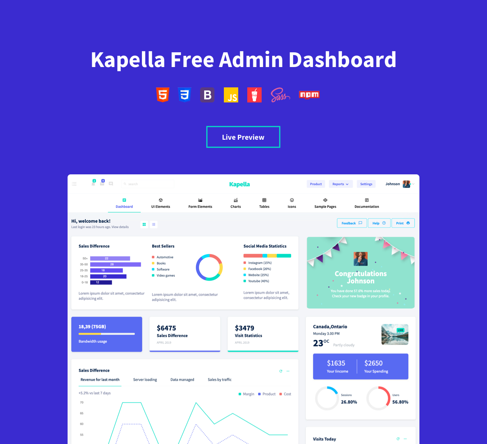

# Kapella-Free-Bootstrap-Admin-Template

Kapella is a responsive Bootstrap admin template that features an elegantly designed horizontal menu. Built with Bootstrap 4, SASS, jQuery, HTML5, and CSS, Kapella boasts a fine selection of page
layouts, widgets, and essential elements. The simple design, clean code, and detailed documentation of the Kapella admin template is bound to impress you. Kapella puts great emphasis on functionality,
aesthetics, and usability to ensure a fine user experience.

Check out the preview of Kapella Admin template [here](http://www.bootstrapdash.com/demo/kapella-free/template/index.html)

<h2>How to use</h2>

<ul>
  <li>
    Download or Clone the repositary
  </li>
  <li>
    Open the file template/index.html in a browser to view the demo
  </li>
  <li>
    Start editing the code as per your requirement
  </li>
  <li>
    If you wish to customize the template, use the command 'npm install' to install the necessary dependencies. Refer <a href="http://www.bootstrapdash.com/demo/kapella-free/template/docs/documentation.html">documentation</a> for more details on customization.
  </li>
</ul>
