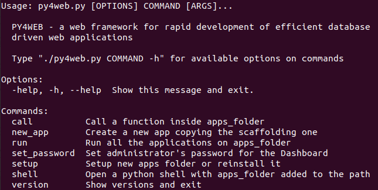

========================
Installation and Startup
========================

Supported platforms and prerequisites
-------------------------------------

PY4WEB runs fine on Windows, MacOS and Linux. Its only prerequisite is
Python 3.6+, which must be installed in advance (except if you use
binaries).

Setup procedures
----------------

There are four alternative ways of running py4web, with different level
of difficulty and flexibility. Let’s look at the pros and cons.

Installing from binaries
~~~~~~~~~~~~~~~~~~~~~~~~

This is not a real installation, because you just copy a bunch of files
on your system without modifying it anyhow. Hence this is the simplest
solution, especially for newbies or students, because it does not
require Python pre-installed on your system nor administrative rights.
On the other hand, it’s experimental, it could contain an old py4web
release and it is quite difficult to add other functionalities to it.

In order to use it you just need to download the latest Windows or MacOS
ZIP file from `this external
repository <https://github.com/nicozanf/py4web-pyinstaller>`__. Unzip it
on a local folder and open a command line there. Finally run

.. code:: bash

   py4web-start set_password
   py4web-start run apps

With this type of installation, remember to always use **py4web-start**
instead of ‘py4web’ or ‘py4web.py’ in the following documentation.

Hint: use a virtual environment (virtualenv)
~~~~~~~~~~~~~~~~~~~~~~~~~~~~~~~~~~~~~~~~~~~~

A full installation of any complex python application like py4web will
surely modify the python environment of your system. In order to prevent
any unwanted change, it’s a good habit to use a python virtual
environment (also called **virtualenv**, see
`here <https://docs.python.org/3.7/tutorial/venv.html>`__ for an
introduction). This is a standard python feature; if you still don’t
know virtualenv it’s a good time to start its discovery!

Activate it before using any of the following *real* installation
procedures is highly reccomended.

Installing from pip
~~~~~~~~~~~~~~~~~~~

Using *pip* is the standard installation procedure for py4web, since it will
quickly install the latest stable release of py4web.

From the command line

.. code:: bash

   python3 -m pip install --upgrade py4web --no-cache-dir --user

but do **not** type the *–user* option with virtualenv or a standard
Windows installation which is already per-user.

Also, if *python3* does not work, try with the simple *python* command
instead.

This will install py4web and all its dependencies on the system’s path
only. The assets folder (that contains the py4web’s system apps) will
also be created. After the installation you’ll be able to start py4web
on any given working folder with

.. code:: bash

   py4web setup apps
   py4web set_password
   py4web run apps

If the command py4web is not accepted, it means it’s not in the system’s
path. On Windows, a special py4web.exe file (pointing to py4web.py) will
be created by *pip* on the system’s path, but not if you type the
*–user* option by mistake.

Installing from source (globally)
~~~~~~~~~~~~~~~~~~~~~~~~~~~~~~~~~

This is the traditional way for installing a program, but it works only
on Linux and MacOS (Windows does not normally support the `make` utility).
All the requirements will be installed on the
system’s path along with links to the py4web.py program on the local
folder

.. code:: bash

   git clone https://github.com/web2py/py4web.git
   cd py4web
   make assets
   make test
   make install
   py4web run apps

Also notice that when installing in this way the content of
``py4web/assets`` folder is missing at first but it is manually created
later with the ``make assets`` command.

Installing from source (locally)
~~~~~~~~~~~~~~~~~~~~~~~~~~~~~~~~

In this way all the requirements will be installed or upgraded on the
system’s path, but py4web itself will only be copied
on a local folder. This is especially useful if you already have a
working py4web installation but you want to test a different
one. Also, installing from sources (locally or globally) will
install all the latest changes present on the master branch of py4web - hence
you will gain the latest (but potentially untested) code.

From the command line, go to a given working folder and then run

.. code:: bash

   git clone https://github.com/web2py/py4web.git
   cd py4web
   python3 -m pip install  --upgrade -r requirements.txt

Once installed, you should always start it from there with:

.. tabs::

   .. group-tab:: Linux and MacOS

      .. code:: bash

         ./py4web.py setup apps
         ./py4web.py set_password
         ./py4web.py run apps

      If you have installed py4web both globally and locally, notice the
      **./** ; it forces the run of the local folder’s py4web and not the
      globally installed one.

   .. group-tab:: Windows

      .. code:: bash

         python3 py4web.py setup apps
         python3 py4web.py set_password
         python3 py4web.py run apps

      On Windows, the programs on the local folder are always executed before
      the ones in the path (hence you don’t need the **./** as on Linux).
      But running .py files directly it’s not usual and you’ll need an explicit
      python3/python command.

      

Upgrading
---------

If you installed py4web from pip you can simple upgrade it with

.. code:: bash

   python3 -m pip install --upgrade py4web

.. warning::

   This will not automatically upgrade the standard apps like **Dashboard**
   and **Default**. 
   You have to manually remove these apps and then run

   .. code:: bash

      py4web setup apps

   in order to re-install them. This is a safety precaution, in case you
   made changes to those apps.

If you installed py4web in any other way, you must upgrade it manually.
First you have to make a backup of any personal py4web work you’ve done,
then delete the old installation folder and re-install the framework
again.

First run
---------

Running py4web using any of the previous procedure should produce an
output like this:

::

   # py4web run apps

.. image:: images/first_run.png
   :class: with-shadow

Generally ``apps`` is the name of the folder where you keep all your
apps, and can be explicitly set wit the ``run`` command. If that
folder does not exist, it is created. PY4WEB expects to find at least
two apps in this folder: **Dashboard** (_dashboard) and **Default**
(_default). If it does not find them, it installs them.

**Dashboard** is a web based IDE. It will be described in the next chapter.

**Default** is an app that does nothing other than welcome the user.

.. note::

   Some apps - like **Dashboard** and **Default** - have a special role in py4web and therefore their actual name starts with ``_``
   to avoid conflicts with apps created by you.

Once py4web is running you can access a specific app at the following
urls:

::

   http://localhost:8000
   http://localhost:8000/_dashboard
   http://localhost:8000/{yourappname}/index

In order to stop py4web, you need to hit :kbd:`Control-C` on the window where you run it.

.. note::

   ONLY the **Default** app is special because if does not require the “{appname}/” prefix in the path, like all the other apps do.
   In general you may want to symlink ``apps/_default`` to your default app.

For all apps the trailing ``/index`` is optional.

.. warning::

   For Windows: it could be that ``Ctrl-C`` does not work in order to stop py4web.
   In this case, try with ``Ctrl-Break`` or ``Ctrl-Fn-Pause``.
   
   
Command line options
--------------------

py4web provides multiple command line options which can be listed by
running it without any argument

::

   # py4web

 
You can have additional help for a specific command line option by running it
with the **–help** or **-h** argument.

.. _call command option:
   
``call`` command option
~~~~~~~~~~~~~~~~~~~~~~~

.. code-block:: none

   # py4web call -h
   Usage: py4web.py call [OPTIONS] APPS_FOLDER FUNC

     Call a function inside apps_folder

   Options:
     --args TEXT        Arguments passed to the program/function  [default: {}]
     -help, -h, --help  Show this message and exit.

.. _new_app command option:

``new_app`` command option
~~~~~~~~~~~~~~~~~~~~~~~~~~

.. code-block:: none

   # py4web new_app -h
   Usage: py4web.py new_app [OPTIONS] APPS_FOLDER APP_NAME

     Create a new app copying the scaffolding one

   Options:
     -s, --scaffold_zip TEXT  Path to the zip with the scaffolding app
     -help, -h, --help        Show this message and exit.

This currently gives an error on binaries installations and from source installation
(locally), because they miss the asset zip file.

.. _run command option:

``run`` command option
~~~~~~~~~~~~~~~~~~~~~~

.. code-block:: none

   # py4web run -h
   Usage: py4web.py run [OPTIONS] [APPS_FOLDER]

     Run all the applications on apps_folder

   Options:
     -Y, --yes                     No prompt, assume yes to questions  [default:
                                   False]

     -H, --host TEXT               Host name  [default: 127.0.0.1]
     -P, --port INTEGER            Port number  [default: 8000]
     -p, --password_file TEXT      File for the encrypted password  [default:
                                   password.txt]

     -s, --server [default|wsgiref|tornado|gunicorn|gevent|waitress|
                   geventWebSocketServer|wsgirefThreadingServer|rocketServer]
                                   server to use  [default: default]
     -w, --number_workers INTEGER  Number of workers  [default: 0]
     -d, --dashboard_mode TEXT     Dashboard mode: demo, readonly, full, none
                                   [default: full]

     --watch [off|sync|lazy]       Watch python changes and reload apps
                                   automatically, modes: off, sync, lazy
                                   [default: off]

     --ssl_cert PATH               SSL certificate file for HTTPS
     --ssl_key PATH                SSL key file for HTTPS
     -help, -h, --help             Show this message and exit.

If you want py4web to automatically reload an application upon any
changes to files of that application, you can:

-  for immediate reloading (sync-mode): ``py4web run --watch=sync``

-  for reloading on any first incoming request to the application has
   been changed (lazy-mode): ``py4web run --watch=lazy``

The default web server used is currently Tornado, but you can change this behaviour with the ``server`` option.

Also, for advanced users, you can specify the optional ''usegevent'' directive like in this example:

.. code:: bash

   py4web usegevent run -s geventWebSocketServer apps

.. warning::
    The optional ''usegevent'' directive must be used with ''gevent'' or ''geventWebSocketServer'' webservers (in order to apply monkey patching)
    and shouldn't be used with ''tornado'' and ''waitress''.

.. _set_password command option:

``set_password`` command option
~~~~~~~~~~~~~~~~~~~~~~~~~~~~~~~

.. code-block:: none

   # py4web set_password -h
   Usage: py4web.py set_password [OPTIONS]

     Set administrator's password for the Dashboard

   Options:
     --password TEXT           Password value (asked if missing)
     -p, --password_file TEXT  File for the encrypted password  [default:
                               password.txt]

     -h, -help, --help         Show this message and exit.

If the ``--dashboard_mode`` is not ``demo`` or ``none``, every time
py4web starts, it asks for a one-time password for you to access the
dashboard. This is annoying. You can avoid it by storing a pdkdf2 hashed
password in a file (by default called password.txt) with the command

.. code:: bash

   py4web set_password

It will not ask again unless the file is deleted. You can also use a
custom file name with

.. code:: bash

   py4web set_password my_password_file.txt

and then ask py4web to re-use that password at runtime with

.. code:: bash

   py4webt run -p my_password_file.txt apps

Finally you can manually create the file yourself with:

::

   $ python3 -c "from pydal.validators import CRYPT; open('password.txt','w').write(str(CRYPT()(input('password:'))[0]))"
   password: *****

.. _setup command option:

``setup`` command option
~~~~~~~~~~~~~~~~~~~~~~~~

.. code-block:: none

   # py4web setup -h
   Usage: py4web.py setup [OPTIONS] [APPS_FOLDER]

     Setup new apps folder or reinstall it

   Options:
     -Y, --yes          No prompt, assume yes to questions  [default: False]
     -help, -h, --help  Show this message and exit.

This option create a new apps folder (or reinstall it). If needed, it
will ask for the confirmation of the new folder’s creation and then for
copying every standard py4web apps from the assets folder. It currently
does nothing on binaries installations and from source installation
(locally) - for them you can manually copy the existing apps folder to
the new one.

.. _shell command option:

``shell`` command option
~~~~~~~~~~~~~~~~~~~~~~~~

.. code-block:: none

   # py4web shell -h
   Usage: py4web.py shell [OPTIONS] [APPS_FOLDER]

     Open a python shell with apps_folder added to the path

   Options:
     -h, -help, --help  Show this message and exit.

Py4web’s shell is just the regular python shell with apps added to the
search path. Notice that the shell is for all the apps, not a single
one. You can then import the needed modules from the apps you need to
access.

For example, inside a shell you can

.. code:: python

   from apps.myapp import db
   from py4web import Session, Cache, Translator, DAL, Field
   from py4web.utils.auth import Auth

.. _version command option:

``version`` command option
~~~~~~~~~~~~~~~~~~~~~~~~~~

.. code-block:: none

   # py4web version -h
   Usage: py4web.py version [OPTIONS]

     Show versions and exit

   Options:
     -a, --all          List version of all modules
     -h, -help, --help  Show this message and exit.

With the *-a* option you’ll get the version of all the available python
modules, too.

Special deployments
-------------------

WSGI
~~~~

py4web is a standard WSGI application. So, if a full program installation it's not
feasible you can simply run py4web as a WSGI app. For example, using gunicorn-cli,
create a pyton file:

.. code:: python

   # py4web_wsgi.py 
   from py4web.core import wsgi
   application = wsgi(apps_folder="apps")
   

and then start the application using cli:

.. code:: bash

   $ gunicorn -w 4 py4web_wsgi:myapp     

The wsgi function takes arguments with the same name as the command line arguments.

Deployment on GCloud (aka Google App Engine)
~~~~~~~~~~~~~~~~~~~~~~~~~~~~~~~~~~~~~~~~~~~~

Login into the `Gcloud console <https://console.cloud.google.com/>`__ and
create a new project. You will obtain a project id that looks like
“{project_name}-{number}”.

In your local file system make a new working folder and cd into it:

.. code:: bash

   mkdir gae
   cd gae

Copy the example files from py4web (assuming you have the source from
github)

::

   cp /path/to/py4web/development_tools/gcloud/* ./

Copy or symlink your ``apps`` folder into the gae folder, or maybe make
a new apps folder containing an empty ``__init__.py`` and symlink the
individual apps you want to deploy. You should see the following
files/folders:

::

   Makefile
   apps
     __init__.py
     ... your apps ...
   lib
   app.yaml
   main.py

Install the Google SDK, py4web and setup the working folder:

.. code:: bash

   make install-gcloud-linux
   make setup
   gcloud config set {your email}
   gcloud config set {project id}

(replace {your email} with your google email account and {project id}
with the project id obtained from Google).

Now every time you want to deploy your apps, simply do:

.. code:: bash

   make deploy

You may want to customize the Makefile and app.yaml to suit your needs.
You should not need to edit ``main.py``.

Deployment on PythonAnywhere.com
~~~~~~~~~~~~~~~~~~~~~~~~~~~~~~~~

Watch the `YouTube video <https://youtu.be/Wxjl_vkLAEY>`__ and follow the `detailed
tutorial <https://github.com/tomcam/py4webcasts/blob/master/docs/how-install-source-pythonanywhere.md>`__
. The bottle_app.py script is in
``py4web/deployment_tools/pythonanywhere.com/bottle_app.py``

