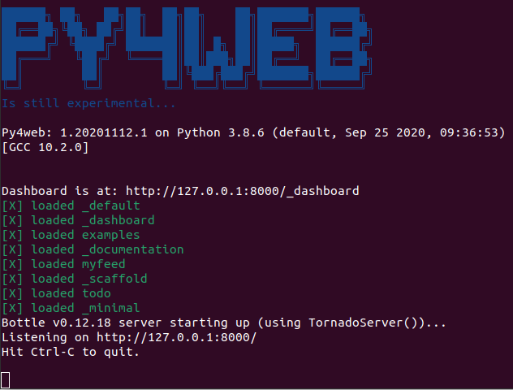
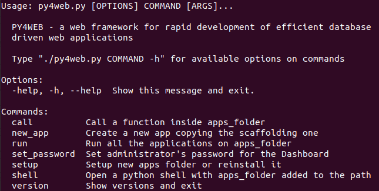

========================
Installation and Startup
========================

Understanding the design
------------------------

Before anything else, it helps to understand that py4web is not just
a Python library you import from your app. It is also a *program* that
runs your apps. So you need two things:

-  the **py4web** package itself (downloaded from our web site, from
   PyPI, or from GitHub);
-  one or more **apps folders** holding the apps you want to serve.

py4web ships with command line options to create an apps folder, add
some example apps to it, and add a scaffolding app you can copy. Once
installed, a single py4web process can serve any number of apps from
the same folder, all on one address and port. An apps folder is itself
a Python package, and each app inside it is also a Python package.

Supported platforms and prerequisites
-------------------------------------

py4web runs fine on Windows, MacOS and Linux. Its only prerequisite is
Python 3.7+, which must be installed in advance (except if you use binaries).

Setup procedures
----------------

There are four alternative ways to install py4web. We will guide you
through each of them; if you get stuck, please
`reach out to us <https://py4web.com/_documentation/static/en/chapter-02.html>`__.

Installing from pip, using a virtual environment
~~~~~~~~~~~~~~~~~~~~~~~~~~~~~~~~~~~~~~~~~~~~~~~~

Installing a complex Python application like py4web modifies the
Python environment of your system. To avoid surprising side effects,
it's a good habit to install py4web inside a Python **virtual
environment** (also called a *virtualenv*; see
`the tutorial <https://docs.python.org/3/tutorial/venv.html>`__
for an introduction). This is a standard Python feature; if you have
not used virtualenvs before, now is a good time to start.

Here are the instructions for creating the virtual environment, activating it,
and installing py4web in it:

.. tabs::

   .. group-tab:: Linux and MacOS

      ::

         python3 -m venv venv
         . venv/bin/activate
         python -m pip install --upgrade py4web --no-cache-dir
         py4web setup apps
         py4web set_password
         py4web run apps

      The command for starting py4web is the same with or without a
      virtual environment::

         py4web run apps

   .. group-tab:: Windows

      ::

         REM open cmd.exe in (for example) c:\py4web
         python3 -m venv venv
         "C:\py4web\venv\Scripts\activate.bat"
         python -m pip install --upgrade py4web --no-cache-dir
         cd venv\Scripts
         py4web.exe setup apps
         py4web.exe set_password
         py4web.exe run apps

      PowerShell activation scripts are available in the same folder.
      The command for starting py4web is the same with or without a
      virtual environment::

         py4web run apps

Installing from pip, without virtual environment
~~~~~~~~~~~~~~~~~~~~~~~~~~~~~~~~~~~~~~~~~~~~~~~~

*pip* is the basic installation procedure for py4web, it will
quickly install the latest stable release of py4web.

From the command line

::

   python3 -m pip install --upgrade py4web --no-cache-dir --user

If ``python3`` is not recognised, try specifying the full version
(e.g. ``python3.11``).

This installs py4web and all its dependencies into the system Python
environment. The assets folder (containing py4web's bundled system
apps) is also created. After the installation, you can start py4web
in any working directory with

::

   py4web setup apps
   py4web set_password
   py4web run apps

If the ``py4web`` command is not found, your system PATH does not
include the directory pip installs scripts into. On Windows, pip
normally creates a ``py4web.exe`` shim on PATH — but not if you used
the ``--user`` flag. In that case, run the commands explicitly through
Python:

::

   python3 py4web.py setup apps
   python3 py4web.py set_password
   python3 py4web.py run apps

Installing from source (globally)
~~~~~~~~~~~~~~~~~~~~~~~~~~~~~~~~~

This is the traditional way for installing a program, but it works only
on Linux and MacOS (Windows does not normally support the `make` utility).
All the requirements will be installed on the
system’s path along with links to the py4web.py program on the local
folder

::

   git clone https://github.com/web2py/py4web.git
   cd py4web
   make assets
   make test
   python -m pip install .
   py4web setup apps
   py4web set_password
   py4web run apps

Also notice that when installing in this way the content of
``py4web/assets`` folder is missing at first but it is manually created
later with the ``make assets`` command.

Notice that you can also (and should) install py4web from source inside a virtual environment.

Running from source without installing
~~~~~~~~~~~~~~~~~~~~~~~~~~~~~~~~~~~~~~

In this mode, py4web's dependencies are installed system-wide as
usual, but py4web itself stays in the local folder. This is useful if
you already have a working py4web installation and want to test a
different one alongside it. Both source installs (local and global)
pull from py4web's ``master`` branch, so you get the latest — but
potentially untested — code.

From the command line, go to a given working folder and then run

::

   git clone https://github.com/web2py/py4web.git
   cd py4web
   python3 -m pip install --upgrade -e .

Once installed, you should always start it from there with:

.. tabs::

   .. group-tab:: Linux and MacOS

      ::

         ./py4web.py setup apps
         ./py4web.py set_password
         ./py4web.py run apps

      If you have installed py4web both globally and locally, notice the
      **./** ; it forces the run of the local folder's py4web and not the
      globally installed one.

   .. group-tab:: Windows

      ::

         python3 py4web.py setup apps
         python3 py4web.py set_password
         python3 py4web.py run apps

      On Windows, programs in the current folder are searched before
      those on PATH, so you don't need the ``./`` prefix that Linux
      requires. Running ``.py`` files directly is uncommon though, so
      you'll typically use an explicit ``python3``/``python`` command.

Installing from binaries
~~~~~~~~~~~~~~~~~~~~~~~~

This is not a real installation: you just copy a bundle of files
onto your system without modifying anything else. It is the simplest
option for beginners and students, because it does not require Python
to be installed and does not require administrator rights. The
trade-offs are real, though: the bundle is experimental, may not
include the latest py4web release, has limited DAL support, and is
hard to extend with extra functionality.

In order to use it you just need to download the latest Windows or MacOS
ZIP file from
`this external repository <https://github.com/nicozanf/py4web-pyinstaller>`__.
Unzip it on a local folder and open a command line there. Finally run

::

   ./py4web set_password
   ./py4web run apps

(omit './' if you're using Windows).

Note that the binaries may lag behind the latest ``master`` or stable
branch of py4web, although we do our best to keep them up to date.

Upgrading
---------

If you installed py4web from pip you can simply upgrade it with

::

   python3 -m pip install --upgrade py4web

.. warning::

   This will not automatically upgrade the standard apps like **Dashboard**
   and **Default**. 
   You have to manually remove these apps and then run

   ::

      py4web setup <path to apps_folder>

   in order to re-install them. This is a safety precaution, in case you
   made changes to those apps.

If you installed py4web in any other way, you must upgrade it manually.
First you have to make a backup of any personal py4web work you've done,
then delete the old installation folder and re-install the framework
again.

Running Using uv
~~~~~~~~~~~~~~~~

This is the newest way to manage python packages.
Install uv as shown here: https://docs.astral.sh/uv/getting-started/installation/
Then run:

::

     uv run py4web.py run apps
     
More uv command examples are in the provided Makefile

First run
---------

Running py4web with any of the procedures above produces an output
like this:
  

By convention ``apps`` is the name of the folder where you keep all
your apps, and the name is set explicitly by the ``run`` command.
(Nothing prevents you from grouping apps into multiple folders with
different names.) If the folder does not exist, py4web creates it.
PY4WEB expects at least two apps in that folder: **Dashboard**
(``_dashboard``) and **Default** (``_default``). If they are missing,
py4web installs them.

**Dashboard** is a web based IDE. It will be described in the next chapter.

**Default** is an app that does nothing other than welcome the user.

.. note::

   Some apps - like **Dashboard** and **Default** - have a special role in py4web and therefore their actual name starts with ``_``
   to avoid conflicts with apps created by you.

Once py4web is running you can access a specific app at the following
urls from the local machine:

::

   http://localhost:8000
   http://localhost:8000/_dashboard
   http://localhost:8000/{yourappname}/index

In order to stop py4web, you need to hit :kbd:`Control-C` on the window where you run it.

.. note::

   The **Default** app is special: it does not require the
   ``{appname}/`` prefix in the URL, unlike every other app.  In
   practice you may want to symlink ``apps/_default`` to your real
   default app.

For all apps the trailing ``/index`` is also optional.

.. warning::

   For Windows: it could be that ``Ctrl-C`` does not work in order to stop py4web.
   In this case, try with ``Ctrl-Break`` or ``Ctrl-Fn-Pause``\.
   
   
Command line options
--------------------

py4web provides multiple command line options which can be listed by
running it without any argument

::

   # py4web

 
You can have additional help for a specific command line option by running it
with the **–help** or **-h** argument.

.. _call command option:
   
``call`` command option
~~~~~~~~~~~~~~~~~~~~~~~

::

   # py4web call -h
   Usage: py4web.py call [OPTIONS] APPS_FOLDER FUNC

     Call a function inside apps_folder

   Options:
     -Y, --yes          No prompt, assume yes to questions  [default: False]
     --args TEXT        Arguments passed to the program/function  [default: {}]
     -help, -h, --help  Show this message and exit.

For example:

::

   # py4web call apps examples.test.myfunction --args '{"x": 100}'

where ``myfunction`` is the function to call in
``apps/examples/test.py``. Use the single and double quotes exactly
as shown so that the shell passes ``--args`` through correctly.

.. _new_app command option:

``new_app`` command option
~~~~~~~~~~~~~~~~~~~~~~~~~~

::

   # py4web new_app -h
   Usage: py4web.py new_app [OPTIONS] APPS_FOLDER APP_NAME

     Create a new app copying the scaffolding one

   Options:
     -Y, --yes                No prompt, assume yes to questions  [default:
                              False]

     -s, --scaffold_zip TEXT  Path to the zip with the scaffolding app
     -help, -h, --help        Show this message and exit.

This currently gives an error on binaries installations and from source installation
(locally), because they miss the asset zip file.

.. _run command option:

``run`` command option
~~~~~~~~~~~~~~~~~~~~~~

::

   # py4web run -h
   Usage: py4web.py run [OPTIONS] APPS_FOLDER

     Run the applications on apps_folder

   Options:
      -Y, --yes                       No prompt, assume yes to questions
      -H, --host TEXT                 Host listening IP  [default: 127.0.0.1]
      -P, --port INTEGER              Port number  [default: 8000]
      -A, --app_names TEXT            List of apps to run, comma separated (all if
                                       omitted or empty)
      -p, --password_file TEXT        File for the encrypted password  [default:
                                       password.txt]
      -Q, --quiet                     Suppress server output
      -R, --routes                    Write apps routes to file
      -s, --server [default|wsgiref|tornado|wsgiref+threaded|rocket|waitress|gunicorn|gevent|gunicorn+gevent|gevent+websockets]
                                       Web server to use (unavailable: waitress,
                                       gunicorn, gevent, gunicorn+gevent,
                                       gevent+websockets)
      -w, --number_workers INTEGER    Number of workers  [default: 0]
      -d, --dashboard_mode TEXT       Dashboard mode: demo, readonly, full, none
                                       [default: full]
      --watch [off|sync|lazy]         Watch python changes and reload apps
                                       automatically, modes: off, sync, lazy
                                       [default: lazy]
      --ssl_cert PATH                 SSL certificate file for HTTPS
      --ssl_key PATH                  SSL key file for HTTPS
      --errorlog TEXT                 Where to send error logs
                                       (:stdout|:stderr|tickets_only|{filename})
                                       [default: :stderr]
      -L, --logging_level INTEGER     The log level (0 - 50) [default: 30
                                       (=WARNING)]
      -D, --debug                     Debug switch
      -U, --url_prefix TEXT           Prefix to add to all URLs in and out
      -m, --mode TEXT                 default or development  [default: default]
      -help, -h, --help               Show this message and exit.

The ``app_names`` option lets you filter which apps to serve
(comma-separated). If omitted or empty, every app in ``APPS_FOLDER``
runs.

For security reasons, py4web listens only on ``127.0.0.1`` (localhost)
by default. To reach it from another machine, set the host
explicitly: ``py4web run --host 0.0.0.0 apps``.

The ``url_prefix`` option adds a prefix to every route py4web
generates and accepts. It is useful when you need several py4web
instances on different ports to coexist behind a single reverse
proxy: each instance gets its own prefix, and the proxy forwards
requests by matching that prefix. Example:
``py4web run --url_prefix=/abracadabra --port 8000 apps``.

By default py4web automatically reloads an app whenever its Python
files change. In *lazy* mode (the default), the reload happens on the
first incoming request after the change. For immediate reloading use
``--watch sync``. For production, use ``--watch off`` to skip the file
checks entirely; you will then need to restart py4web manually for
changes to take effect.

.. note::
    The ``--watch`` directive looks for any changes occurring to the python files under the
    ``/apps`` folder only. Any modifications to the standard py4web programs will always require a full
    restart of the framework. 

The default web server is ``rocketServer``; change it with the
``--server`` option.
`Rocket3 <https://github.com/web2py/rocket3>`__ is the multi-threaded
server originally used by web2py, stripped of its Python 2 logic and
dependencies.

The ``--logging_level`` values come from the standard Python
``logging`` module. The default is 30 (``WARNING``). Other common
values are 0 (``NOTSET``), 10 (``DEBUG``), 20 (``INFO``), 40
(``ERROR``) and 50 (``CRITICAL``). Setting a level tells the logger
to emit every event at that level or higher.

The ``--debug`` flag forces ``logging_level`` to 0 and additionally
logs every fixture call as well as when a session is found, considered
invalid, or saved.

.. _set_password command option:

``set_password`` command option
~~~~~~~~~~~~~~~~~~~~~~~~~~~~~~~

::

   # py4web set_password -h
   Usage: py4web.py set_password [OPTIONS]

     Set administrator's password for the Dashboard

   Options:
     --password TEXT           Password value (asked if missing)
     -p, --password_file TEXT  File for the encrypted password  [default:
                               password.txt]

     -h, -help, --help         Show this message and exit.

If ``--dashboard_mode`` is not ``demo`` or ``none``, py4web asks
for a fresh dashboard password every time it starts. To avoid that
prompt, store a PBKDF2-hashed password in a file (by default
``password.txt``) with:

::

   py4web set_password

It will not ask again unless the file is deleted. You can also use a
custom file name with

::

   py4web set_password my_password_file.txt

and then ask py4web to re-use that password at runtime with

::

   py4web run -p my_password_file.txt apps

Finally you can manually create the file yourself with:

::

   python3 -c "from pydal.validators import CRYPT; open('password.txt','w').write(str(CRYPT()(input('password:'))[0]))"
   password: *****

.. _setup command option:

``setup`` command option
~~~~~~~~~~~~~~~~~~~~~~~~

::

   # py4web setup -h
   Usage: py4web.py setup [OPTIONS] APPS_FOLDER

     Setup new apps folder or reinstall it

   Options:
     -Y, --yes          No prompt, assume yes to questions  [default: False]
     -help, -h, --help  Show this message and exit.

This command creates a new apps folder (or reinstalls one). When
needed it asks for confirmation before creating the folder and before
copying the standard py4web apps from the assets folder. ``setup``
currently has no effect on binary or local-source installations — for
those, copy the existing apps folder to the new location manually.

.. _shell command option:

``shell`` command option
~~~~~~~~~~~~~~~~~~~~~~~~

::

   # py4web shell -h
   Usage: py4web.py shell [OPTIONS] APPS_FOLDER

     Open a python shell with apps_folder's parent added to the path

   Options:
     -Y, --yes          No prompt, assume yes to questions  [default: False]
     -h, -help, --help  Show this message and exit.

``py4web shell`` is the regular Python interactive shell with the
apps folder added to ``sys.path``. The shell sees every installed app,
not just one, so you can import from any of them.

For example, inside the shell you can run:

.. code:: python

   from apps.myapp import db
   from py4web import Session, Cache, Translator, DAL, Field
   from py4web.utils.auth import Auth

.. _version command option:

``version`` command option
~~~~~~~~~~~~~~~~~~~~~~~~~~

::

   # py4web version -h
   Usage: py4web.py version [OPTIONS]

     Show versions and exit

   Options:
     -a, --all          List version of all modules
     -h, -help, --help  Show this message and exit.

With the ``--all`` option you also get the version of every Python
module currently available.

Special installations
---------------------

There are special cases in which you cannot or don't want to use one of the generic installation
instructions we've already described. There is a special folder called ``deployment_tools`` in
the py4web repository that collects some special recipes. They are briefly described here, along
with some tips and tricks.

HTTPS
~~~~~

To use https with the build-in web server (Rocket3) these are the steps:

- Generate the localhost certificates. For example follow the instructions here:
   
   https://www.section.io/engineering-education/how-to-get-ssl-https-for-localhost/.

- Restart your browser and browse securely to your web site.

If you use VSCode to run py4web you may want to update the py4web launch.json file to contain:

.. code:: json

    "configurations": [
            {
                "name": "py4web",
                "type": "debugpy",
                "request": "launch",
                "module": "py4web",
                // or "program": "${workspaceFolder}/py4web.py", if you didn't install py4web as a package
                "args": [
                    "run",
                    "apps",
                    "--ssl_cert", "/path_to/localhost.crt",
                    "--ssl_key", "/path_to/localhost.key",
                    "--server", "rocketServer",
                ]
            }
        ]

Notice that /path_to/ should be the absolute path to the location of your certificate.

WSGI
~~~~

py4web is a standard WSGI application. So, if a full program installation is not
feasible you can simply run py4web as a WSGI app. For example, using gunicorn-cli,
create a python file:

.. code:: python

   # py4web_wsgi.py 
   from py4web.core import wsgi
   application = wsgi(apps_folder="apps")
   

and then start the application using cli:

::

   gunicorn -w 4 py4web_wsgi:application

The wsgi function takes arguments with the same name as the command line arguments.

Deployment on GCloud (aka GAE - Google App Engine)
~~~~~~~~~~~~~~~~~~~~~~~~~~~~~~~~~~~~~~~~~~~~~~~~~~

Login into the `Gcloud console <https://console.cloud.google.com/>`__ and
create a new project. You will obtain a project id that looks like
“{project_name}-{number}”.

In your local file system make a new working folder and cd into it:

::

   mkdir gae
   cd gae

Copy the example files from py4web (assuming you have the source from
github)

::

   cp /path/to/py4web/development_tools/gcloud/* ./

Copy or symlink your ``apps`` folder into the gae folder, or maybe make
a new apps folder containing an empty ``__init__.py`` and symlink the
individual apps you want to deploy. You should see the following
files/folders:

::

   Makefile
   apps
     __init__.py
     ... your apps ...
   lib
   app.yaml
   main.py

Install the Google SDK, py4web and setup the working folder:

::

   make install-gcloud-linux
   make setup
   gcloud config set {your email}
   gcloud config set {project id}

(replace {your email} with your google email account and {project id}
with the project id obtained from Google).

Now every time you want to deploy your apps, simply do:

::

   make deploy

You may want to customize the Makefile and app.yaml to suit your needs.
You should not need to edit ``main.py``.

Deployment on PythonAnywhere.com
~~~~~~~~~~~~~~~~~~~~~~~~~~~~~~~~

Watch the `YouTube video <https://youtu.be/Wxjl_vkLAEY>`__ and follow the `detailed
tutorial <https://github.com/tomcam/py4webcasts/blob/master/docs/how-install-source-pythonanywhere.md>`__
. The bottle_app.py script is in
``py4web/deployment_tools/pythonanywhere.com/bottle_app.py``

Deployment on Docker/Podman
~~~~~~~~~~~~~~~~~~~~~~~~~~~

On ``deployment_tools/docker`` there is a simple Dockerfile for quickly running a py4web container. There is also
a docker-compose.yml file for setting up a more complex multi-container with PostgreSQL. 
A ready docker example based on the Scaffold application can be cloned from this repository <https://github.com/macneiln/docker-py4web-scaffold>

You can also use them with Podman, which has the advantage of not
requiring ``sudo`` and not running a background daemon.

Deployment on Ubuntu
~~~~~~~~~~~~~~~~~~~~

``deployment_tools/ubuntu`` contains a bash script tested with
Ubuntu Server 20.04.03 LTS. It uses nginx and self-signed
certificates and can optionally configure ``iptables`` as well.
