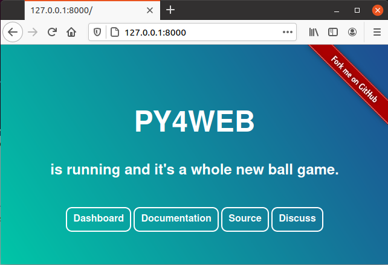
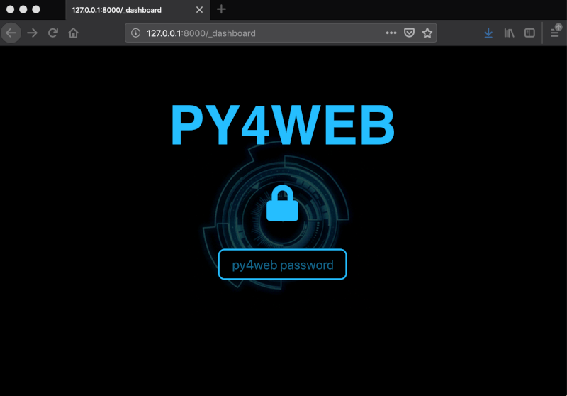
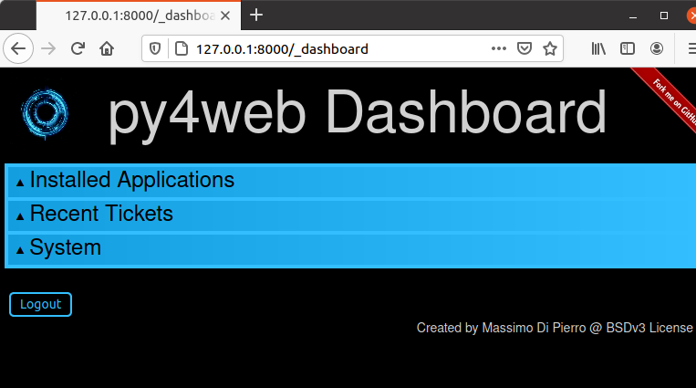
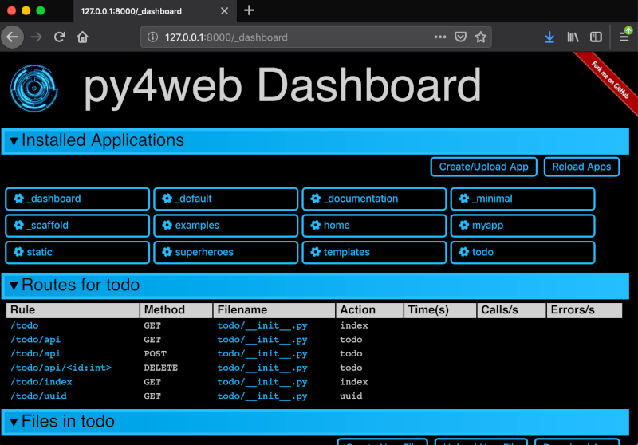
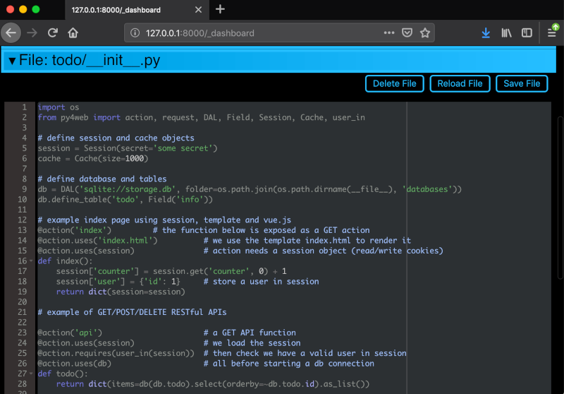
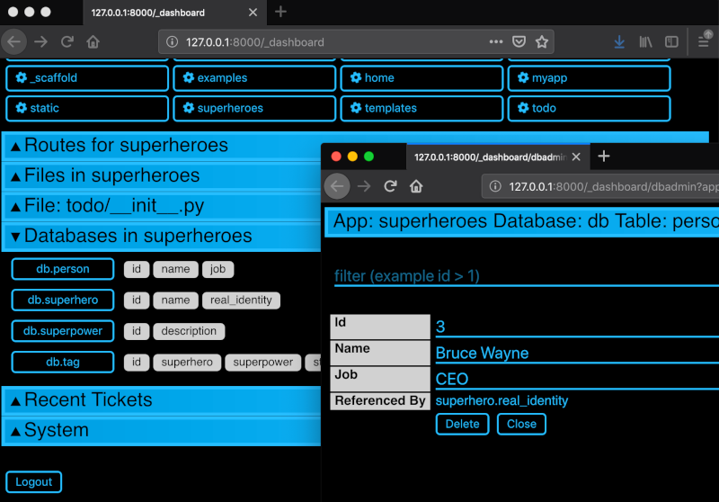
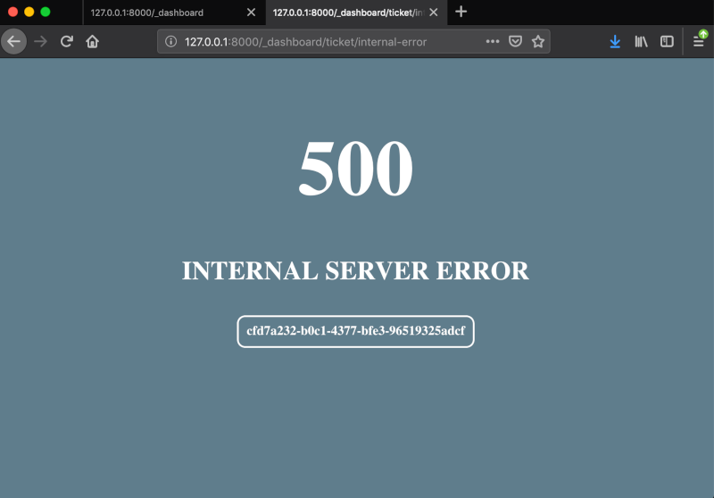
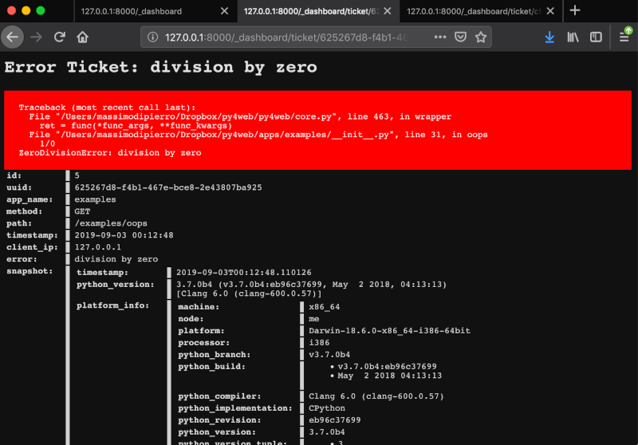

=============
The Dashboard
=============

The Dashboard is the bundled, web-based IDE for py4web. You will use
it extensively to manage applications and inspect databases. Browsing
its interface is also a good way to get a feel for py4web and its
components.

The main web page
-----------------

When you start py4web, it launches a web server that listens on
http://127.0.0.1:8000 — that is, TCP port 8000 on your local machine,
over plain HTTP.

By default this address is reachable only from the local machine. Open
it in a browser like Firefox or Google Chrome:

.. FIXME: why do this image fit into the pdf page while the others do not?

The buttons are:

- Dashboard (http://127.0.0.1:8000/_dashboard), which we'll describe
  in this chapter.
- Documentation (http://127.0.0.1:8000/_documentation?version=1.20201112.1),
  for browsing the local copy of this Manual.
- Source (https://github.com/web2py/py4web), pointing to the
  GitHub repository.
- Discuss (https://groups.google.com/forum/#!forum/py4web), pointing
  to the Google mail group.

Login into the Dashboard
------------------------

Click the Dashboard button to reach the Dashboard login. Enter the
password you set up earlier (see :ref:`set_password command option`).
If you don't remember it, stop py4web with ``Ctrl-C``, set a new
password, and start py4web again.

After you enter the correct dashboard password, the dashboard appears
with all of its tabs collapsed.

.. FIXME: why do this image fit into the pdf page while the others do not?

Click on a tab title to expand. Tabs are context dependent. For example,
open tab “Installed Applications” and click on an installed application
to select it.

This will create new tabs “Routes”, “Files”, and “Model”
for the selected app.

The “Files” tab lets you browse the folder that contains the selected
app and edit any file in it. By default, edits are picked up
automatically the next time the app is requested. If you launched
py4web with a different ``--watch`` setting (see
:ref:`run command option`), click “Reload Apps” under “Installed
Applications” for changes to take effect.
If an app fails to load, its button turns red. Click it to see the
underlying error.

The Dashboard exposes every app's database through PyDAL's REST API
and provides a web interface for searching and performing CRUD
operations against those databases.

If a user visits an app and triggers a bug, the user is issued a
ticket.

The ticket is recorded in the py4web service database. The dashboard
shows the most common recent issues and lets you search through
tickets.

