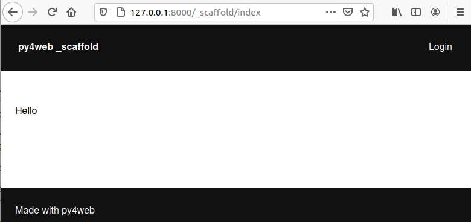

===============
Creating an app
===============

From scratch
------------

Apps can be created from the dashboard or directly on the filesystem.
We will do it manually here; the dashboard is covered in its own
chapter.

An app is a Python package, so all you need is a folder containing
an ``__init__.py`` file.

.. note::
   Strictly speaking, ``__init__.py`` is not required since Python
   3.3 (which supports namespace packages), but creating one keeps
   things simple and lets you add code there later.

Open a command prompt and ``cd`` into your apps folder. Run these
two commands to create an empty **myapp** app:

.. code:: bash

   mkdir apps/myapp
   touch apps/myapp/__init__.py

.. tip::
   On Windows, use backslashes (``\``) in paths instead of slashes.

If you now restart py4web (or press “Reload Apps” in the Dashboard),
py4web finds this folder, imports it, and recognises it as an app —
purely from its location.

By default py4web runs in *lazy watch* mode (see
:ref:`run command option`), which automatically reloads an app the
first time it is requested after a change. That is very useful during
development. In production or while debugging an unrelated issue, you
may want to disable the watcher:

.. code:: bash

    py4web run apps --watch off

A py4web app does not have to *do* anything. It can be a container
for static files or for utility code that other apps import. Most
apps, however, exist to serve static or dynamic web pages, which is
what we will look at next.

Static web pages
----------------

To serve static files, create a ``static`` subfolder. Anything you
place inside it is automatically published:

.. code:: bash

   mkdir apps/myapp/static
   echo 'Hello World' > apps/myapp/static/hello.txt

The newly created file will be accessible at

.. code:: bash

   http://localhost:8000/myapp/static/hello.txt

``static`` is a reserved path: only files inside the ``static``
folder are served.

.. important::

   Internally py4web uses the
   `ombott (One More BOTTle) web server <https://github.com/valq7711/ombott>`__,
   which is a minimal and fast `bottlepy <https://bottlepy.org/>`__ spin-off.
   It supports streaming, partial content, range requests,
   and if-modified-since. This is all
   handled automatically based on the HTTP request headers.

Dynamic web pages
-----------------

A dynamic page is a Python function that returns the page content.
For example, edit ``myapp/__init__.py`` as follows:

.. code:: python

   import datetime
   from py4web import action

   @action('index')
   def page():
       return "hello, now is %s" % datetime.datetime.now()

Reload the app, and this page will be accessible at

::

   http://localhost:8000/myapp/index

or

::

   http://localhost:8000/myapp

(notice that index is optional)

Unlike many other frameworks, you do not import or start a web server
inside ``myapp``: py4web is already running, possibly serving several
apps at once. py4web imports your module and exposes any function
decorated with ``@action()``.

Notice that py4web automatically prepends ``/myapp`` (the app name) to
the path declared in ``@action``. Multiple apps could otherwise
declare colliding routes; prefixing each route with the app name
keeps them separate. The one exception is the app called
``_default`` (or a symlink from ``_default`` to ``myapp``): its
routes are exposed without a prefix.

On return values
~~~~~~~~~~~~~~~~

A py4web action should return either a string or a dictionary. If
the action returns a string, py4web sends it to the client as-is. If
it returns a dictionary, py4web needs to know how to render it; by
default it serialises the dictionary as JSON. As an example, edit
``__init__.py`` and add at the end:

.. code:: python

   @action('colors')
   def colors():
       return {'colors': ['red', 'blue', 'green']}

This page will be visible at

::

   http://localhost:8000/myapp/colors

and returns a JSON object ``{"colors": ["red", "blue", "green"]}``.
Notice we chose to name the function the same as the route. This is not
required, but it is a convention that we will often follow.

You can use any template language to turn your data into a string.
PY4WEB ships with YATL; the full chapter on YATL comes later, and a
short example follows below.

Routes
~~~~~~

Parts of the URL can be captured and passed to the function as
arguments. For example:

.. code:: python

   @action('color/<name>')
   def color(name):
       if name in ['red', 'blue', 'green']:
           return 'You picked color %s' % name
       return 'Unknown color %s' % name

This page will be visible at

::

   http://localhost:8000/myapp/color/red

The pattern syntax is the same as
`Bottle's <https://bottlepy.org/docs/dev/tutorial.html#request-routing>`__.
A wildcard takes one of these forms:

-  ``<name>``
-  ``<name:filter>``
-  ``<name:filter:config>``

The available filters are (only ``:re`` accepts a config):

-  ``:int`` — matches (signed) digits and converts the captured value
   to an ``int``.
-  ``:float`` — same as ``:int`` but for decimal numbers.
-  ``:path`` — matches any characters, including ``/``, in a
   non-greedy way; useful for capturing more than one URL segment.
-  ``:re[:exp]`` — match a custom regular expression supplied in the
   config field. The captured string is left as-is.

The captured value is passed to your function via the parameter
``name``.

Note that ombott implements routing as a hybrid radix-tree router. It
is independent of declaration order and prefers static route segments
over dynamic ones, which is the behaviour most users expect.

One consequence is that you cannot register two routes that put
dynamic segments of different types in the same position. So the
following **does not work** and will raise an error at registration:

.. code:: python

   @action('color/<code:int>')
   def color(code):
       return f'Color code: {code}'
   
   @action('color/<name:path>')
   def color(name):
       return f'Color name: {name}'

To get a similar effect, handle both cases inside a single action:

.. code:: python
   
   @action('color/<color_identifier:path>')
   def color(color_identifier):
      try:
         msg = f'Color code: {int(color_identifier)}'
      except:
         msg = f'Color name: {color_identifier}'
      return msg

``@action`` takes an optional ``method`` argument, either a single
HTTP method or a list:

::

   @action('index', method=['GET', 'POST', 'DELETE'])

To expose the same function under multiple routes, stack
``@action`` decorators on the function.

The ``request`` object
~~~~~~~~~~~~~~~~~~~~~~

From py4web you can import ``request``

.. code:: python

    from py4web import request

    @action('paint')
    def paint():
        if 'color' in request.query:
           return 'Painting in %s' % request.query.get('color')
        return 'You did not specify a color'

This action can be accessed at:

::

   http://localhost:8000/myapp/paint?color=red

The ``request`` object is the same as a
`Bottle request object <https://bottlepy.org/docs/dev/api.html#the-request-object>`__,
with one additional attribute:

::

   request.app_name

You can use it to look up the name (and therefore the folder) of the
app currently handling the request.

Templates
~~~~~~~~~

To render a YATL template, declare it on the action. For example,
create the file ``apps/myapp/templates/paint.html`` containing:

.. code:: html

   <html>
    <head>
       
    </head>
    <body>
       <h1>Color [[=color]]</h1>
    </body>
   </html>
   
then modify the paint action to use the template and default to green.

.. code:: python

   @action('paint')
   @action.uses('paint.html')
   def paint():
       return dict(color = request.query.get('color', 'green'))

The page will now display the color name on a background of the
corresponding color.

The key ingredient here is the ``@action.uses(...)`` decorator. Its
arguments are called **fixtures**. You can list several fixtures in
one decorator, or stack multiple ``@action.uses`` decorators on the
same function. Fixtures are objects that modify the behaviour of the
action: they may initialise per-request state, filter the action's
input or output, and depend on one another (similar in scope to
Bottle plugins, but declared per-action and resolved through a
dependency tree, explained in a later chapter).

The simplest fixture is a template — and the simplest way to declare
one is to pass its filename. The file must use YATL syntax and live
inside the app's ``templates`` folder. py4web feeds the dictionary
returned by the action through the template to produce the response
string.

You can also write your own fixtures for other template languages; we
cover that later on.

Some built-in fixtures are:

-  the DAL object (which tells py4web to obtain a database connection
   from the pool at every request, and commit on success or rollback on
   failure)
-  the Session object (which tells py4web to parse the cookie and
   retrieve a session at every request, and to save it if changed)
-  the Translator object (which tells py4web to process the
   accept-language header and determine optimal
   internationalization/pluralization rules)
-  the Auth object (which tells py4web that the app needs access to the
   user info)

They may depend on each other. For example, the Session may need the DAL
(database connection), and Auth may need both. Dependencies are handled
automatically.

The \_scaffold app
------------------

Most of the time you do not want to start from a blank folder, and
you do want to follow a few sensible conventions — for instance, not
putting all your code into ``__init__.py``. PY4WEB ships with a
**scaffolding** app (``_scaffold``) where files are already organised
properly and many useful objects are pre-defined. It also demonstrates
user registration and login.

Like real scaffolding on a construction site, the scaffold app gives
you a quick, simplified structure to start from while you build the
real project on top of it.

You will normally find the scaffold app under apps, but you can easily
create a new clone of it manually or using the Dashboard.

Here is the tree structure of the ``_scaffold`` app:

::

   ├── __init__.py          # imports everything else
   ├── common.py            # defines useful shared objects (db, session, auth, T, cache, ...)
   ├── controllers.py       # your actions
   ├── databases/           # SQLite files and migration metadata
   ├── models.py            # your PyDAL table definitions
   ├── settings.py          # configuration values used by the app
   ├── settings_private.py  # (optional) configuration you want to keep out of git
   ├── static/              # static files served from /myapp/static/
   │   ├── css/
   │   │   └── no.css       # default classless CSS framework
   │   ├── favicon.ico
   │   └── js/
   │       └── utils.js     # small JS helper library bundled with the scaffold
   ├── tasks.py             # background tasks (Scheduler / Celery)
   ├── templates/           # YATL templates
   │   ├── auth.html        # registration/login/etc. (uses a Vue.js component)
   │   ├── generic.html     # generic fallback template
   │   ├── index.html       # home page
   │   └── layout.html      # base layout extended by other templates
   └── translations/        # i18n / pluralization JSON files
       └── it.json          # an Italian translation example

The scaffold app contains an example of a more complex action:

.. code:: python

   from py4web import action, request, response, abort, redirect, URL
   from yatl.helpers import A
   from . common import db, session, T, cache, auth

   @action('welcome', method='GET')
   @action.uses('generic.html', session, db, T, auth.user)
   def index():
       user = auth.get_user()
       message = T('Hello {first_name}'.format(**user))
       return dict(message=message, user=user)

Notice the following:

-  ``request``, ``response``, ``abort`` are defined by ``ombott``.
-  ``redirect`` and ``URL`` are similar to their web2py counterparts.
-  helpers (``A``, ``DIV``, ``SPAN``, ``IMG``, etc) must be imported
   from ``yatl.helpers`` . They work pretty much as in web2py.
-  ``db``, ``session``, ``T``, ``cache``, ``auth`` are Fixtures. They
   must be defined in ``common.py``.
-  ``@action.uses(auth.user)`` indicates that this action expects a
   valid logged-in user retrievable by ``auth.get_user()``. If that is
   not the case, this action redirects to the login page (defined also
   in ``common.py`` and using the Vue.js auth.html component).

When you start from the scaffold you typically edit ``settings.py``,
the templates, ``models.py`` and ``controllers.py`` — and rarely
need to touch ``common.py``.

py4web does not impose a particular JS or CSS framework, so in your
HTML you can use whatever you like. The one exception is
``auth.html``, which uses a Vue.js component to handle registration,
login and the related screens. If you want to keep using that built-in
auth UI, do not remove it.

.. _copying-the-scaffold-app:

Copying the \_scaffold app
--------------------------

The scaffold app is very useful as a starting point for both
experiments and full-featured production apps.

Don't edit it in place — always copy it first. You have two options:

-  using the command line: copy the whole apps/_scaffold folder to another one
   (apps/my_app for example). Then reload py4web and it will be automatically loaded.
-  using the Dashboard: select the button ``Create/Upload App`` under the "Installed
   Applications" upper section. Just give the new app a name and check that "Scaffold"
   is selected as the source. 
   Finally press the ``Create`` button and the dashboard will be automatically reloaded,
   along with the new app.

   .. image:: images/dashboard_new_app.png

Watching files for changes
--------------------------

As mentioned in :ref:`run command option`, py4web makes development
easy by automatically reloading an app when its Python source files
change (this is the default). You can watch additional, non-Python
files too, by registering a handler with the ``@app_watch_handler``
decorator.

Two examples follow. Don't worry if the details are not yet clear —
the key point is that any file inside an app can trigger a custom
action when modified, simply by declaring it with
``@app_watch_handler``.

Watch SASS files and compile them when edited:

.. code:: python

   from py4web.core import app_watch_handler
   import sass # https://github.com/sass/libsass-python

   @app_watch_handler(
       ["static_dev/sass/all.sass",
        "static_dev/sass/main.sass",
        "static_dev/sass/overrides.sass"])
   def sass_compile(changed_files):
       print(changed_files) # for info, files that changed, from a list of watched files above
       ## ...
       compiled_css = sass.compile(filename=filep, include_paths=includes, output_style="compressed")
       dest = os.path.join(app, "static/css/all.css")
       with open(dest, "w") as file:
           file.write(compiled)

Validate javascript syntax when edited:

.. code:: python

   import esprima # Python implementation of Esprima from Node.js

   @app_watch_handler(
       ["static/js/index.js",
        "static/js/utils.js",
        "static/js/dbadmin.js"])
   def validate_js(changed_files):
       for cf in changed_files:
           print("JS syntax validation: ", cf)
           with open(os.path.abspath(cf)) as code:
               esprima.parseModule(code.read())

File paths passed to ``@app_watch_handler`` are relative to the app.
Python files (``*.py``) in the list are ignored because they are
watched by default. The handler receives a list of file paths that
were just changed. Any exception raised inside a handler is printed
to the terminal.

Domain-mapped apps
------------------

A production deployment often needs to serve several apps from a
single py4web process, with each app reachable on its own domain.

py4web has no built-in domain-to-app mapping; you do the mapping
outside py4web with a reverse proxy (such as nginx). A reverse proxy
is also useful for SSL termination and caching, but here we cover
only the domain mapping itself.

A minimal nginx configuration mapping the app ``myapp`` to the
domain ``myapp.example.com`` looks like this:

.. code:: console

   server {
      listen 80;
      server_name myapp.example.com;
      proxy_http_version 1.1;
      proxy_set_header Host $host;
      proxy_set_header X-PY4WEB-APPNAME /myapp;
      location / {
         proxy_pass http://127.0.0.1:8000/myapp$request_uri;
      }
   }

You need a separate ``server`` block for **each app / each domain**.
The important details are:

- ``server_name`` is the domain mapped to ``myapp``.
- ``proxy_http_version 1.1;`` is optional but strongly recommended;
  otherwise nginx talks HTTP/1.0 to the backend, which causes
  buffering and connection-reuse issues.
- ``proxy_set_header Host $host;`` ensures the correct ``Host`` value
  (here ``myapp.example.com``) reaches py4web.
- ``proxy_set_header X-PY4WEB-APPNAME /myapp;`` tells py4web (and
  ombott) which app to serve and that the app is domain-mapped. Note
  the leading slash on ``/myapp``: it is **required** for ombott to
  parse URLs correctly.
- ``proxy_pass http://127.0.0.1:8000/myapp$request_uri;`` forwards
  the full request (``$request_uri``) to py4web at
  ``127.0.0.1:8000`` under the ``/myapp`` prefix.

This configuration ensures that all URL building inside ombott and
py4web — especially in ``Auth``, ``Form`` and ``Grid`` — uses the
domain the app is mapped to.

Custom error pages
------------------

py4web ships default error pages. For example, if no route matches
the request, the user sees a default 404 page. Every HTTP error code
is handled automatically out of the box.

You can override this behaviour either per HTTP code or for every
error at once.

Here is an example for overriding HTTP code 404 (not found):

.. code:: python

   from py4web.core import ERROR_PAGES
   ERROR_PAGES[404] = f"Page not found!"

To replace *all* default error pages, use the special key ``"*"``.
The returned string may include HTML:

.. code:: python

   from py4web import URL
   from py4web.core import ERROR_PAGES
   from yatl.helpers import A

   ERROR_PAGES["*"] = f"We have encountered an error! (try: {A('Main Page', _href=URL("/",scheme=True))})"

``ERROR_PAGES`` is **global**: it is shared across every app served
by the py4web process. That is intentional — when a request fails to
match any registered route, py4web does not even know which app the
user was aiming for, so the error pages have to be set in one place.
Configure ``ERROR_PAGES`` in **only one** of your apps.