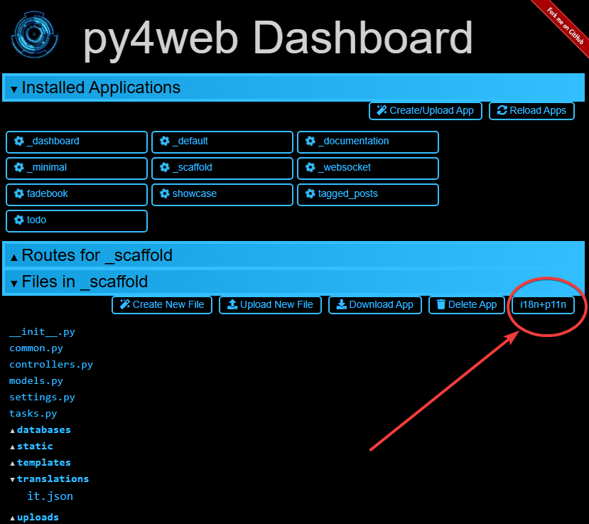
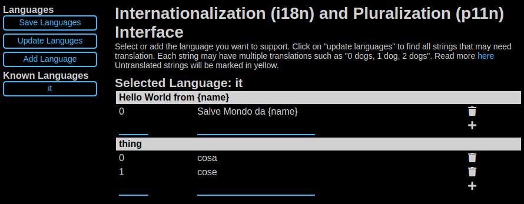

========
Fixtures
========

A fixture is defined as “a piece of equipment or furniture which is
fixed in position in a building or vehicle”. In our case a fixture is
something attached to the action that processes an HTTP request in order
to produce a response.

When processing any HTTP requests there are some optional operations we
may want to perform. For example parse the cookie to look for session
information, commit a database transaction, determine the preferred
language from the HTTP header and lookup proper internationalization,
etc. These operations are optional. Some actions need them and some
actions do not. They may also depend on each other. For example, if
sessions are stored in the database and our action needs it, we may need
to parse the session cookie from the HTTP header, pick up a connection from
the database connection pool, and - after the action has been executed -
save the session back in the database if data has changed.

PY4WEB fixtures provide a mechanism to specify what an action needs so
that py4web can accomplish the required tasks (and skip non required
ones) in the most efficient manner. Fixtures make the code efficient and
reduce the need for boilerplate code. Think of fixtures as per action
(as opposed to per app) middleware.

PY4WEB fixtures are similar to WSGI middleware and BottlePy plugin
except that they apply to individual actions, not to all of them, and
can depend on each other.

PY4WEB comes with some pre-defined fixtures:
sessions, url signing and flash messages will be fully 
explained in this chapter. Database connections, internationalization,
authentication, and templates will instead be just outlined here since
they have dedicated chapters.

The developer is also free to add fixtures, for example, to handle a third
party template language or third party session logic; this is explained
later in the :ref:`Custom fixtures` paragraph.

Using Fixtures
--------------

As we've seen in the previous chapter, fixtures are the arguments of the decorator
``@action.uses(...)``. You can specify
multiple fixtures in one decorator or you can have multiple decorators.

Also, fixtures can be applied in groups. For example:

::

   preferred = action.uses(session, auth, T, flash)

Then you can apply all of them at once with:

::

   @action('index')
   @preferred
   def index():
       return dict()

Usually, it's not important the order you use to specify the fixtures, because py4web
knows well how to manage them if they have explicit dependencies. For example auth
depends explicitly on db and session and flash, so you do not even needs to list them.

But there is an important exception: the Template fixture must always be the
**first one**. Otherwise, it will not have access to various things it should
need from the other fixtures, especially Inject() and Flash() that we'll see later.

The Template fixture
--------------------

PY4WEB by default uses the YATL template language and provides a
fixture for it.

.. code:: python

   from py4web import action
   from py4web.core import Template

   @action('index')
   @action.uses(Template('index.html', delimiters='[[ ]]'))
   def index(): 
       return dict(message="Hello world")
  
Note: this example assumes that you created the application from the
scaffolding app, so that the template index.html is already created for
you.

The Template object is a Fixture. It transforms the ``dict()`` returned
by the action into a string by using the ``index.html`` template file.
In a later chapter we will provide an example of how to define a custom
fixture to use a different template language, for example Jinja2.

Notice that since the use of templates is very common and since, most
likely, every action uses a different template, we provide some
syntactic sugar, and the two following lines are equivalent:

.. code:: python

   @action.uses('index.html')
   @action.uses(Template('index.html', delimiters='[[ ]]'))

Also notice that py4web template files are cached in RAM. The py4web caching
object is described later on :ref:`Caching and Memoize`.

.. warning::
   If you use multiple fixtures, always place the template as the **first one**.
   

   For example:

      .. code:: python

         @action.uses(session, db, 'index.html') # wrong
         @action.uses('index.html', session, db) # right

   
   Be careful if you read old documentations that this need was **exactly the
   opposite** in early py4web experimental versions (until February 2022)!

As we've already seen in the last paragraph, you can combine many fixtures in
one decorator. But you can even extend this decorator by passing different
templates as needed. For example:

.. code:: python

   def preferred(template, *optional): 
      return action.uses(template, session, auth, T, flash, *optional)

And then:

.. code:: python

   @action('index')
   @preferred('index.html')
   def index():
      return dict()

This syntax has no performance implications: it's just for avoiding to replicate a decorator logic in multiple places.
In this way you'll have cleaner code and if needed you'll be able to change it later in one place only.

The Inject fixture
------------------

The Inject fixture is used for passing variables (and even python functions) to
templates. Here is a simple example:

.. code:: python

   from py4web.utils.factories import Inject
   my_var = "Example variable to be passed to a Template"

   ...

   @action.uses('index.html', Inject(my_var=my_var))
   def index():

      ...

It will be explained later on :ref:`Using Inject` in the YATL chapter.

The Translator fixture
----------------------

Here is an example of usage:

.. code:: python

   from py4web import action, Translator
   import os

   T_FOLDER = os.path.join(os.path.dirname(__file__), 'translations')
   T = Translator(T_FOLDER)

   @action('index')
   @action.uses(T)
   def index(): return str(T('Hello world'))

The string ``hello world`` will be translated based on the
internationalization file in the specified “translations” folder that
best matches the HTTP ``accept-language`` header.

Here ``Translator`` is a py4web class that extends
``pluralize.Translator`` and also implements the ``Fixture`` interface.

We can easily combine multiple fixtures. Here, as example, we make
action with a counter that counts “visits”.

.. code:: python

   from py4web import action, Session, Translator, DAL
   from py4web.utils.dbstore import DBStore
   import os
   db = DAL('sqlite:memory')
   session =  Session(storage=DBStore(db))
   T_FOLDER = os.path.join(os.path.dirname(__file__), 'translations')
   T = Translator(T_FOLDER)

   @action('index')
   @action.uses(session, T)
   def index():
       counter = session.get('counter', -1)
       counter += 1
       session['counter'] = counter
       return str(T("You have been here {n} times").format(n=counter))

If the ``T`` fixture is to be used from inside a template you may want to pass it to the template:

.. code:: python

   @action('index')
   @action.uses("index.html", session, T)
   def index():
       return dict(T=T)

Or perhaps inject (same effect as above)

.. code:: python

   from py4web.utils.factories import Inject

   @action('index')
   @action.uses("index.html", session, Inject(T=T)
   def index():
       return dict()

Now create the following translation file ``translations/en.json``:

.. code:: json

   {"You have been here {n} times": 
     {
       "0": "This your first time here", 
       "1": "You have been here once before", 
       "2": "You have been here twice before",
       "3": "You have been here {n} times",
       "6": "You have been here more than 5 times"
     }
   }

When visiting this site with the browser language preference set to
English and reloading multiple times you will get the following
messages:

::

   This your first time here
   You have been here once before
   You have been here twice before
   You have been here 3 times
   You have been here 4 times
   You have been here 5 times
   You have been here more than 5 times

Now try create a file called ``translations/it.json`` which contains:

.. code:: json

   {"You have been here {n} times":
     {
       "0": "Non ti ho mai visto prima",
       "1": "Ti ho gia' visto",
       "2": "Ti ho gia' visto 2 volte",
       "3": "Ti ho visto {n} volte",
       "6": "Ti ho visto piu' di 5 volte"
     }
   }

Set your browser preference to Italian: now the messages will be
automatically translated to Italian.

Notice there is an UI in the Dashboard for creating, updating, and updating translation files. 
It can be easily reached via the button ``i18n+p11n``:

that leads to the following interface:

More details can be found here: https://github.com/web2py/pluralize 

If you want to force an action to use language defined somewhere else, for example from a session variable, you can do:

.. code:: python

   @action('index')
   @action.uses("index.html", session, T)
   def index():
       T.select(session.get("lang", "it"))
       return dict(T=T)

If you want all of your action to use the same pre-defined language and ignore browser preferences,
you have to redefine the select method for the T instance:

.. code:: python

   T.on_request = lambda *_: T.local.__dict__.update(tag="it", language=T.languages["it"])

This is to be done outside any action and will apply to all actions. Action will still need to declare 
``action.uses(T)`` else the behavior is undefined.

The Flash fixture
-----------------

It is common to want to display “alerts” to the users. Here we refer to
them as **flash messages**. There is a little more to it than just
displaying a message to the view, because flash messages:

-  can have state that must be preserved after redirection
-  can be generated both server side and client side
-  may have a type
-  should be dismissible

The Flash helper handles the server side of them. Here is an example:

.. code:: python

   from py4web import Flash

   flash = Flash()

   @action('index')
   @action.uses(flash)
   def index():
       flash.set("Hello World", _class="info", sanitize=True)
       return dict()

and in the template:

.. code:: html

   <flash-alerts class="padded" data-alert="[[=globals().get('flash','')]]"></flash-alerts>

By setting the value of the message in the flash helper, a flash
variable is returned by the action and this triggers the JS in the
template to inject the message in the ``py4web-flash`` DIV which you
can position at your convenience. Also the optional class is applied to
the injected HTML.

If a page is redirected after a flash is set, the flash is remembered.
This is achieved by asking the browser to keep the message temporarily
in a one-time cookie. After redirection the message is sent back by the
browser to the server and the server sets it again automatically before
returning the content, unless it is overwritten by another set.

The client can also set/add flash messages by calling:

::

   Q.flash({'message': 'hello world', 'class': 'info'});

py4web defaults to an alert class called ``info`` and most CSS
frameworks define classes for alerts called ``success``, ``error``,
``warning``, ``default``, and ``info``. Yet, there is nothing in py4web
that hardcodes those names. You can use your own class names.

You can see the basic usage of flash messages in the **examples** app.

The Session fixture
-------------------

Simply speaking, a session can be defined as a way to preserve information that is
desired to persist throughout the user's interaction with the web site or web application.
In other words, sessions render the stateless HTTP connection a stateful one.

In py4web, the session object is also a fixture. Here is a simple example of its usage
to implement a counter.

::

   from py4web import Session, action
   session = Session(secret='my secret key')

   @action('index')
   @action.uses(session)
   def index():
       counter = session.get('counter', -1)
       counter += 1
       session['counter'] = counter
       return "counter = %i" % counter

The counter will start from 0; its value will be remembered and
increased every time you reload the page.

.. image:: images/simple_counter.png

Opening the page in a new browser tab will give you the updated
counter value. Closing and reopening the browser, or opening a
new *private window*, will instead restart the counter from 0.

Usually the information is saved in the session object are related
to the user - like its username, preferences, last pages visited,
shopping cart and so on. The session object has the same interface
as a Python dictionary but in py4web sessions are always stored using
JSON (**JWT** specifically, i.e. 
`JSON Web Token <https://jwt.io/introduction>`__),
therefore you should only store objects that are JSON serializable.
If the object is not JSON serializable, it will be serialized using
the ``__str__`` operator and some information may be lost.

The information composing the session object can be saved:

- client-side, by only using cookies (default)
- server-side, but you'll still need minimal cookies for identifying
  the clients

By default py4web sessions never expire (unless they contain login
information, but that is another story) even if an expiration can be
set. Other parameters can be specified as well:

::

   session = Session(secret='my secret key',
                     expiration=3600,
                     algorithm='HS256',
                     storage=None,
                     same_site='Lax',
                     name="{app_name}_sesson")

Here:

-  ``secret`` is the passphrase used to sign the information
-  ``expiration`` is the maximum lifetime of the session, in seconds
   (default = None, i.e. no timeout)  
-  ``algorithm`` is the algorithm to be used for the JWT token
   signature ('HS256' by default)
-  ``storage`` is a parameter that allows to specify an alternate
   session storage method (for example Redis, or database). If not
   specified, the default cookie method will be used
-  ``same_site`` is an option that prevents CSRF attacks (Cross-Site
   Request Forgery) and is enabled by default with the 'Lax' option.
   You can read more about it
   `here <https://owasp.org/www-community/SameSite>`__
-  ``name`` is the format to use for the session cookie name.

If storage is not provided, session is stored in client-side jwt cookie.
Otherwise, we have server-side session: the jwt is stored in storage and
only its UUID key is stored in the cookie. This is the reason why the
secret is not required with server-side sessions.

Client-side session in cookies
~~~~~~~~~~~~~~~~~~~~~~~~~~~~~~

By default the session object is stored inside a cookie called
``appname_session``. It's a JWT, hence encoded in a URL-friendly string
format and signed using the provided secret for preventing tampering.

.. warning::

   Data embedded in cookies is signed, not encrypted! In fact it's quite
   trivial to read its content from http communications or from disk, so
   do not place any sensitive information inside, and use a complex secret.

If the secret changes existing sessions are invalidated.
If the user switches from HTTP to HTTPS or
vice versa, the user session is also invalidated. Session in cookies have a
small size limit (4 kbytes after being serialized and encoded) so do
not put too much into them.

Server-side session in memcache
~~~~~~~~~~~~~~~~~~~~~~~~~~~~~~~

Requires memcache installed and configured.

.. code:: python

   import memcache, time
   conn = memcache.Client(['127.0.0.1:11211'], debug=0)
   session = Session(storage=conn)

Server-side session in Redis
~~~~~~~~~~~~~~~~~~~~~~~~~~~~

Requires `Redis <https://redis.io/>`__ installed and configured.

.. code:: python

   import redis
   conn = redis.Redis(host='localhost', port=6379)
   conn.set = lambda k, v, e, cs=conn.set, ct=conn.ttl: (cs(k, v), e and ct(e))
   session = Session(storage=conn)

Notice: a storage object must have ``get`` and ``set`` methods and the
``set`` method must allow to specify an expiration. The redis connection
object has a ``ttl`` method to specify the expiration, hence we monkey
patch the ``set`` method to have the expected signature and
functionality.

Server-side session in database
~~~~~~~~~~~~~~~~~~~~~~~~~~~~~~~

.. code:: python

   from py4web import Session, DAL
   from py4web.utils.dbstore import DBStore
   db = DAL('sqlite:memory')
   session =  Session(storage=DBStore(db))

.. warning::
   the ``'sqlite:memory'`` database used in this example
   **cannot be used in multiprocess environment**;
   the quirk is that your application will still work but in non-deterministic
   and unsafe mode, since each process/worker will have its own independent
   in-memory database.

This is one case when a fixture (session) requires another
fixture (db). This is handled automatically by py4web and the following lines
are equivalent:

.. code:: python

   @action.uses(session)
   @action.uses(db, session)

Server-side session anywhere
~~~~~~~~~~~~~~~~~~~~~~~~~~~~

You can easily store sessions in any place you want. All you need to do
is provide to the ``Session`` object a ``storage`` object with both
``get`` and ``set`` methods. For example, imagine you want to store
sessions on your local filesystem:

.. code:: python

   import os
   import json

   class FSStorage:
      def __init__(self, folder):
          self.folder = folder
      def get(self, key):
          filename = os.path.join(self.folder, key)
          if os.path.exists(filename):
              with open(filename) as fp:
                 return json.load(fp)
          return None
      def set(self, key, value, expiration=None):
          filename = os.path.join(self.folder, key)
          with open(filename, 'w') as fp:
              json.dump(value, fp)

   session = Session(storage=FSStorage('/tmp/sessions'))

We leave to you as an exercise to implement expiration, limit the number
of files per folder by using subfolders, and implement file locking. Yet
we do not recommend storing sessions on the filesystem: it is
inefficient and does not scale well.

Sharing sessions
~~~~~~~~~~~~~~~~

Imagine you have an app "app1" which uses a session and an app "app2" that wants to share a session with app1. Assuming they use sessions in cookies, 
"app2" would use:

.. code:: python

   session = Session(secret=settings.SESSION_SECRET_KEY,
                     name="app1_session")
   
The name tells app2 to use the cookie "app1_session" from app1. Notice it is important that the secret is the same as app1's secret. If using a session 
in db, then app2 must be using the same db as app1. It is up to the user to make sure that the data stored in the session and shared between the two apps 
are consistent and we strongly recommend that only app1 writes to the session, unless the share one and the same database.

Notice that it is possible for one app to handle multiple sessions. For example one session may be its own, and another may be used exclusively to read 
data from another app (app1) running on the same server:

.. code:: python

   session_app1 = Session(secret=settings.SESSION_SECRET_KEY,
                          name="app1_session")
   ...
   @action.uses(session, session_app1)	  
   ...

The Condition fixture
---------------------

Sometimes you want to restrict access to an action based on a
given condition. For example to enforce a workflow:

.. code:: python

   @action("step1")
   @action.uses(session)
   def step1():
       session["step_completed"] = 1
       button = A("next", _href=URL("step2"))
       return locals()

   @action("step2")
   @action.uses(session, Condition(lambda: session.get("step_completed") == 1))
   def step2():
       session["step_completed"] = 2
       button = A("next", _href=URL("step3"))
       return locals()

   @action("step3")
   @action.uses(session, Condition(lambda: session.get("step_completed") == 2))
   def step3():
       session["step_completed"] = 3
       button = A("next", _href=URL("index"))
       return locals()

Notice that the Condition fixtures takes a function as first argument
which is called ``on_request`` and must evaluate to True or False.

Also notice that in the above example the Condition depends on the Session
therefore it must be listed after ``session`` in ``action.uses``.

If False, by default, the Condition fixture raises 404.
It is possible to specify a different exception:

.. code:: python

   Condition(cond, exception=HTTP(400))

It is also possible to call a function before the exception is raised,
for example, to redirect to another page:

.. code:: python

   Condition(cond, on_false=lambda: redirect(URL('step1')))

You can use condition to check permissions. For example, if you
are giving group memberships to users using ``Tags`` (it will be explained
later on the :ref:`Authorization using Tags` chapter), then you can
require that users action have specific group membership:

.. code:: python

   groups = Tags(db.auth_user)

   @action("payroll")
   @action.uses(auth, 
                Condition(lambda: 'employees' in groups.get(auth.user_id), on_false=lambda: redirect('index')))
   def payroll():
       return

The URLsigner fixture
---------------------

A signed URL is a URL that provides limited permission and time to make an
HTTP request by containing authentication information in its query string.
The typical usage is as follows:

.. code:: python
   
   from py4web.utils import URLSigner

   # We build a URL signer.
   url_signer = URLSigner(session)

   @action('/somepath')
   @action.uses(url_signer)
   def somepath():
      # This controller signs a URL.
      return dict(signed_url = URL('/anotherpath', signer=url_signer))
   
   @action('/anotherpath')
   @action.uses(url_signer.verify())
   def anotherpath():
      # The signature has been verified.
      return dict()

The DAL fixture
---------------

We have already used the ``DAL`` fixture in the context of sessions but
maybe you want direct access to the DAL object for the purpose of
accessing the database, not just sessions.

PY4WEB, by default, uses the **PyDAL** (Python Database Abstraction Layer)
which is documented in the next chapter. Here is an example, please
remember to create the ``databases`` folder under your project in case
it doesn't exist:

.. code:: python

   from datetime import datetime
   from py4web import action, request, DAL, Field
   import os

   DB_FOLDER = os.path.join(os.path.dirname(__file__), 'databases')
   db = DAL('sqlite://storage.db', folder=DB_FOLDER, pool_size=1)
   db.define_table('visit_log', Field('client_ip'), Field('timestamp', 'datetime'))
   db.commit()

   @action('index')
   @action.uses(db)
   def index():
       client_ip = request.environ.get('REMOTE_ADDR')
       db.visit_log.insert(client_ip=client_ip, timestamp=datetime.utcnow())
       return "Your visit was stored in database"

Notice that the database fixture defines (creates/re-creates) tables
automatically when py4web starts (and every time it reloads this app)
and picks a connection from the connection pool at every HTTP request.
Also each call to the ``index()`` action is wrapped into a transaction
and it commits ``on_success`` and rolls back ``on_error``.

The Auth fixture
----------------

``auth`` and ``auth.user`` are both fixtures that depend on
``session`` and ``db``. Their role is to provide the action with
authentication information.

Auth is used as follows:

.. code:: python

   from py4web import action, redirect, Session, DAL, URL
   from py4web.utils.auth import Auth
   import os

   session = Session(secret='my secret key')
   DB_FOLDER = os.path.join(os.path.dirname(__file__), 'databases')
   db = DAL('sqlite://storage.db', folder=DB_FOLDER, pool_size=1)
   auth = Auth(session, db)
   auth.enable()

   @action('index')
   @action.uses(auth)
   def index():
       user = auth.get_user() or redirect(URL('auth/login'))
       return 'Welcome %s' % user.get('first_name')

The constructor of the ``Auth`` object defines the ``auth_user`` table
with the following fields: username, email, password, first_name,
last_name, sso_id, and action_token (the last two are mostly for
internal use).

If a ``auth_user`` table is defined before calling ``auth.enable()``
the provided table will be used.

It is also possible to add ``extra_fields`` to the ``auth_user`` table,
for example:

.. code:: python

   extra_fields = [
      Field("favorite_color"),
   ]
   auth = Auth(session, db, extra_fields=extra_fields)

In any case, we recommend not to pollute the ``auth_user`` table with
extra fields but, instead, to use one of more additional custom
tables that reference users and store the required information.
   
The ``auth`` object exposes the method:``auth.enable()`` which
registers multiple actions including ``{appname}/auth/login``.
It requires the presence of the ``auth.html`` template and the
``auth`` value component provided by the
``_scaffold`` app. It also exposes the method:

.. code:: python

   auth.get_user()

which returns a python dictionary containing the information of the
currently logged in user. If the user is not logged-in, it returns
``None`` and in this case the code of the example redirects to the
``auth/login`` page.

Since this check is very common, py4web provides an additional fixture
``auth.user``:

.. code:: python

   @action('index')
   @action.uses(auth.user)
   def index():
       user = auth.get_user()
       return 'Welcome %s' % user.get('first_name')

This fixture automatically redirects to the ``auth/login`` page if user
is not logged-in, hence this example is equivalent to the previous one.

The ``auth`` fixture is plugin based: it supports multiple plugin
methods including OAuth2 (Google, Facebook, Twitter), PAM and LDAP.
The :ref:`Authentication and authorization` chapter will show you
all the related details.

Caveats about fixtures
----------------------

Since fixtures are shared by multiple actions you are not allowed to
change their state because it would not be thread safe. There is one
exception to this rule. Actions can change some attributes of database
fields:

.. code:: python

   from py4web import action, request, DAL, Field
   from py4web.utils.form import Form
   import os

   DB_FOLDER = os.path.join(os.path.dirname(__file__), 'databases')
   db = DAL('sqlite://storage.db', folder=DB_FOLDER, pool_size=1)
   db.define_table('thing', Field('name', writable=False))

   @action('index')
   @action.uses('generic.html', db)
   def index():
       db.thing.name.writable = True
       form = Form(db.thing)
       return dict(form=form)

Note that this code will only be able to display a form, to process it
after submit, additional code needs to be added, as we will see later
on. This example is assuming that you created the application from the
scaffolding app, so that a generic.html is already created for you.

The ``readable``, ``writable``, ``default``, ``update``, and ``require``
attributes of ``db.{table}.{field}`` are special objects of class
``ThreadSafeVariable`` defined the ``threadsafevariable`` module. These
objects are very much like Python thread local objects but they are
re-initialized at every request using the value specified outside of the
action. This means that actions can safely change the values of these
attributes.

Custom fixtures
---------------

A fixture is an object with the following minimal structure:

.. code:: python

   from py4web.core import Fixture

   class MyFixture(Fixture):
       def on_request(self, context): pass
       def on_success(self, context): pass
       def on_error(self, context) pass

For example in the DAL fixture case, ``on_request`` starts a transaction,
``on_success`` commits it, and ``on_error`` rolls it back.

In the case of a template, ``on_request`` and ``on_error`` do nothing but
``on_success`` transforms the output.

In the case of ``auth.user`` fixtures, ``on_request`` does all the work of
determining if the user is logged in (from the dependent session fixture)
and eventually preventing the request from accessing the inner layers.

Now imagine a request coming in calling an action with three fixtures A, B, and C.
Under normal circumstances above methods are executed in this order:

.. code::
   
   request  -> A.on_request -> B.on_request -> C.on_request -> action
   response <- A.on_success <- B.on_success <- C.on_success <-

i.e. the first fixture (A) is the first one to call ``on_request``
and the last one to call ``on_success``. You can think of them as layers of
an onion with the action (user code) at the center. ``on_success`` is called
when entering a layer from the outside and ``on_success`` is called when
exiting a layer from the inside (like WSGI middleware).

If any point an exception is raised inner layers are not called
and outer layers will call ``on_error`` instead of ``on_success``.

Context is a shared object which contains:

- content['fixtures']: the list of all the fixtures for the action.
- context['processed']: the list of fixtures that called ``on_request`` previously within the request.
- context['exception']: the exception raised by the action or any previous fixture logic (usually None)
- context['output']: the action output.

``on_success`` and ``on_error`` can see the current ``context['exception']`` and
transform it. They can see the current ``context['output']`` and transform it as well.

For example here is a fixture that transforms the output text to upper case:

.. code:: python

   class UpperCase(Fixture):
       def on_success(self, context):
           context['output'] = context['output'].upper()

   upper_case = UpperCase()

   @action('index')
   @action.uses(upper_case)
   def index(): return "hello world"
   
Notice that this fixture assumes the ``context['output']`` is a string
and therefore it must come before the template.

Here is a fixture that logs exceptions tracebacks to a file:

.. code:: python

   class LogErrors(Fixture):
       def __init__(self, filename):
           self.filename = filename
       def on_error(self, context):
           with open(self.filename, "a") as stream:
               stream.write(str(context['exception']) + '\n')
     
   errlog = LogErrors("myerrors.log")

   @action('index')
   @action.uses(errlog)
   def index(): return 1/0

Fixtures also have a ``__prerequisite__`` attribute. If a fixture
takes another fixture as an argument, its value must be appended
to the list of ``__prerequisites__``. This guarantees that they are
always executed in the proper order even if listed in the wrong order.
It also makes it optional to declare prerequisite fixtures in ``action.uses``.

For example ``Auth`` depends on ``db``, ``session``, and ``flash``. ``db`` and ``session``
are indeed arguments. ``flash`` is a special singleton fixture declared within ``Auth``.
This means that

.. code:: python

  action.uses(auth)

is equivalent to

.. code:: python

  action.uses(auth, session, db, flash)

Why are fixtures not simply functions that contain a try/except?

We considered the option but there are some special exceptions that should
not be considered errors but success (``py4web.HTTP``, ``bottle.HTTResponse``)
while other exceptions are errors. The actual logic can be complicated 
and individual fixtures do not need to know these details.

They all need to know what the context is and whether they are
processing a new request or a response and whether the response is a success
or an error. We believe this logic keeps the fixtures easy.

Fixtures should not in general communicate with each other but nothing
prevents one fixture to put data in the context and another fixture to
retrieve that data.

Fixtures with dependencies
~~~~~~~~~~~~~~~~~~~~~~~~~~

If a fixture depends on another fixture, it needs to be passed that fixture in the initializer, 
and the fixture must be listed in the ``__prerequisites__`` attribute.
For example, suppose we want to create a fixture that grants access to a controller only
to users whose email address is included in an ADMIN_EMAILS list. 
We can write the following fixture:

.. code:: python

    class AdminAccess(Fixture):

        def __init__(self, auth, admin_list, redirect_url=None):
            super().__init__()
            self.admin_list = admin_list
            self.auth = auth
            self.__prerequisites__ = [auth]
            # One thing to note here is that the URL function can only be called in a 
            # request context (while serving a request).  Thus, we cannot store in the fixture
            # initialization the full URL to redirect, but only the path. 
            self.redirect_url = redirect_url or 'index'
            
        def on_request(self, context):
            if ((not self.auth.current_user) 
                or self.auth.current_user.get('email') not in self.admin_list):
                redirect(URL(self.redirect_url))
                     
        def on_error(self, context):
            redirect(URL(self.redirect_url))

The fixture can be created and used as follows:

.. code:: python

    admin_access = AdminAccess(auth, ['a@example.com',], 'index')

    @action('/admin-only')
    @action.uses('admin_only.html', admin_access)
    def admin_only():
        return dict()

Using local storage
~~~~~~~~~~~~~~~~~~~

Fixtures can use a thread-local storage for data they need.  
Here is an example: 

.. code:: python

    class LocalStorageDemo(Fixture):
        
       def __init__(self):
           super().__init__()
          
       def on_request(self, context):
           Fixture.local_initialize(self) 
           # We can check whether the local storage is valid. 
           print(f"is_valid: {self.is_valid()}")
           content = str(uuid.uuid4())
           print(f"Storing content: {content}")
           self.local.my_content = content
               
       def on_success(self, context):
           # The line below is used only to show that the thread-local object is in place.         
           print(f"Retrieved: {self.local.my_content}")

Notably, the initializer should contain the line: 

.. code:: python

    Fixture.local_initialize(self)

in order to initialize the thread-local storage.
Once this is done, the thread-local storage can be used to store and retrieve data
using the the ``self.local`` object. 

Multiple fixtures
-----------------

As previously stated, it's generally not important the order you use to specify the fixtures
but it's mandatory that you always place the template as the **first one**.
Consider this:

.. code:: python

   @action("index")
   @action.uses(A,B)
   def func(): return "Hello world"

Pre-processing (``on_request``) in the fixtures happen in the sequence they are listed
and then the ``on_success`` or ``on_error`` methods will be executed in reverse order (as
an onion). 

Hence the previous code can be explicitly transformed to:

.. code:: python

   A.on_request()
   B.on_request()
   func()
   B.on_success()
   A.on_success() 

So if A.on_success() is a template and B is an inject fixture that allows you to add
some extra variables to your templates, then A must come first.

Notice that

.. code:: python

   @action.uses(A)
   @action.uses(B)

is almost equivalent to 

.. code:: python

   @action.uses(A,B)

but not quite. All fixtures declared in one ``action.uses`` share
the same context while fixtures in different ``action.uses`` use
different contexts and therefore they cannot communicate with each other.
This may change in the future.
For now we recommend using a single call to ``action.uses``.

Caching and Memoize
-------------------

py4web provides a cache in RAM object that implements the last recently
used (LRU) algorithm. It can be used to cache any function via a
decorator:

.. code:: python

   import uuid
   from py4web import Cache, action
   cache = Cache(size=1000)

   @action('hello/<name>')
   @cache.memoize(expiration=60)
   def hello(name):
       return "Hello %s your code is %s" % (name, uuid.uuid4())

It will cache (memoize) the return value of the ``hello`` function, as
function of the input ``name``, for up to 60 seconds. It will store in
cache the 1000 most recently used values. The data is always stored in
RAM.

The ``cache`` object is not a fixture and it should not and cannot be
registered using the ``@action.uses`` decorator but we mention it here
because some of the fixtures use this object internally. For example,
template files are cached in RAM to avoid accessing the file system
every time a template needs to be rendered.

Convenience Decorators
----------------------

The ``_scaffold`` application, in ``common.py`` defines two special
convenience decorators:

::

   @unauthenticated()
   def index():
       return dict()

and

::

   @authenticated()
   def index():
       return dict()

They apply all of the decorators below (db, session, T, flash, auth),
use a template with the same name as the function (.html), and also
register a route with the name of action followed by the number of
arguments of the action separated by a slash (/).

-  @unauthenticated does not require the user to be logged in.
-  @authenticated required the user to be logged in.

They can be combined with (and precede) other ``@action.uses(...)`` but
they should not be combined with ``@action(...)`` because they perform
that function automatically.
