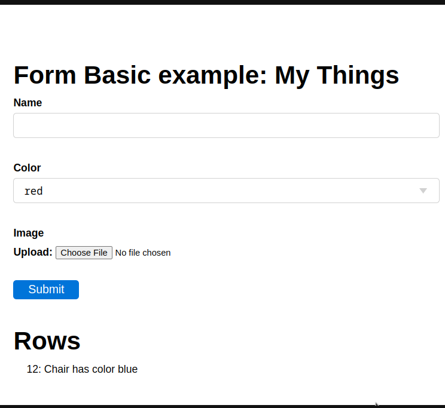

=====
Forms
=====

The Form class provides a high-level API for quickly building CRUD (create, update and delete) forms, 
especially for working on an existing database table. It is a pretty much equivalent to web2py’s ``SQLFORM``.

The Form constructor
--------------------

The ``Form`` constructor accepts the following arguments:

.. code:: python

   Form(self,
        table,
        record=None,
        readonly=False,
        deletable=True,
        formstyle=FormStyleDefault,
        dbio=True,
        keep_values=False,
        form_name=False,
        hidden=None,
        validation=None,
        csrf_session=None,
        csrf_protection=True,
        lifespan=None,
        signing_info=None,
        ):

Where:

-  ``table``: a DAL table or a list of fields
-  ``record``: a DAL record or record id
-  ``readonly``: set to True to make a readonly form
-  ``deletable``: set to False to disallow deletion of record
-  ``formstyle``: a function that renders the form using helpers. Can be FormStyleDefault (default),
   FormStyleBulma or FormStyleBootstrap4 
-  ``dbio``: set to False to prevent any DB writes
-  ``keep_values``: if set to true, it remembers the values of the previously submitted form
-  ``form_name``: the optional name of this form
-  ``hidden``: a dictionary of hidden fields that is added to the form
-  ``validation``: an optional validator, see :ref:`Validation functions`
-  ``csrf_session``: if None, no csrf token is added.  If a session, then a CSRF token is added and verified
-  ``lifespan``: lifespan of CSRF token in seconds, to limit form validity
-  ``signing_info``: information that should not change between when the CSRF token is signed and verified
  

A minimal form example
----------------------

Let's start with a minimal working form example. Create a new minimal app called ``form_minimal`` :

.. code:: python

    # in form_minimal/__init__.py
    from py4web import action, Field, redirect, URL
    from py4web.utils.form import Form
    from pydal.validators import IS_NOT_EMPTY

    @action('index', method=['GET', 'POST'])
    @action.uses('form_minimal.html')
    def index():
        form = Form([
            Field('product_name'),
            Field('product_quantity', 'integer', requires=IS_NOT_EMPTY()),
            ])
        if form.accepted:
            # Do something with form.vars['product_name'] and form.vars['product_quantity']
            redirect(URL('accepted'))
        if form.errors:
            # display message error
            redirect(URL('not_accepted'))
        return dict(form=form)

    @action("accepted")
    def accepted():
        return "form_example accepted"

    @action("not_accepted")
    def not_accepted():
        return "form_example NOT accepted"

Also, you need to create a file inside the app called ``templates/form_minimal.html``
that just contains the line:

.. code:: html

    [[=form]]

Then reload py4web and visit http://127.0.0.1:8000/form_minimal - you'll get the Form page:

.. image:: images/form1.png
 
Note that:

-  ``Form`` is a class contained in the ``py4web.utils.form`` module
-  it's possible to use **form validators** like ``IS_NOT_EMPTY``, see :ref:`Form validation` later.
   They are imported from the ``pydal.validators`` module
-  it's normally important to use both the **GET** and the **POST** methods in the action where
   the form is contained

This example it's not so useful because it's not using a database, a template or the session management.
But it works, and if you try to fill the form with an empty product_quantity, the form will trigger an error
and the corresponding error page will be shown.

Form basic example
------------------

Let's continue with a basic example of a form for adding data to a database. Create a new minimal app called ``form_basic`` :

.. code-block:: python
  :linenos:

    # in form_basic/__init__.py
    import os
    from py4web import action, Field, DAL
    from py4web.utils.form import Form, FormStyleDefault
    
    DB_FOLDER = os.path.join(os.path.dirname(__file__), 'databases')
    if not os.path.isdir(DB_FOLDER):
        os.mkdir(DB_FOLDER)
    db = DAL('sqlite://storage.sqlite', folder=DB_FOLDER)
    db.define_table(
        'person',
        Field('name'),
        Field('job', requires=IS_NOT_EMPTY()),
    )
    
    @action("index", method=["GET", "POST"])
    @action.uses(db, "form_basic.html")
    def index(id=None):
        form = Form(db.person, id, deletable=False, formstyle=FormStyleDefault)
        rows = db(db.person).select()
        return dict(form=form, rows=rows)

After the required import instructions and sqlite database definition,
on line 16 we declare an endpoint ``form_basic/index``,
which will be used both for the GET and for the POST of the form.

Also, create a new template file inside the app called ``templates/form_basic.html`` that
contains the following code:

.. code:: html

    <h2 class="title">Form Superhero Identity</h2>

    [[=form]]

    <h2 class="title">Rows</h2>

    <ul>
    [[for row in rows:]]
    <li>[[=row.id]]: [[=row.name]] ([[=row.job]])</li>
    [[pass]]
    </ul>

Reload py4web and visit http://127.0.0.1:8000/form_basic : 
the result is an input form on the top of the page, and the list of all the
previuos added entries on the bottom:

The database content can also be fully seen and changed with the Dashboard app.

Form validation
---------------

Validators are classes used to validate input fields (including forms generated from database tables).
They are normally assigned using the ``requires`` attribute of a table ``Field`` object, as already
shown on the :ref:`Field constructor` paragraph of the DAL chapter. Also, you can use advanced validators
in order to create widgets such as drop-down menus, radio buttons and even lookups from other tables.
Last but not least, you can even explicitly define a validation function. 

Here is a simple example of how to require a validator for a table field:

.. code:: python

    db.define_table(
        'person',
        Field('name',requires=IS_NOT_EMPTY(),
        Field('job')
    )

The validator is frequently
 written explicity outside the table definition in this equivalent manner:

.. code:: python

    db.define_table(
        'person',
        Field('name'),
        Field('job')
    )
    db.person.name.requires = IS_NOT_EMPTY()

A field can have a single validator or multiple validators. Multiple validators are made part of a list:

.. code:: python

    db.person.name.requires = [IS_NOT_EMPTY(),
                            IS_NOT_IN_DB(db, 'person.name')]

Mind that the only validators that can be used with ``list:`` type fields are:

-  ``IS_IN_DB(..., multiple=True)``
-  ``IS_IN_SET(..., multiple=True)``
-  ``IS_NOT_EMPTY()``
-  ``IS_LIST_OF_EMAILS()``
-  ``IS_LIST_OF(...)``

The latter can be used to apply any validator to the individual items in the list. ``multiple=(1, 1000)`` requires a selection of between 1 and 1000 items. This enforces selection of at least one choice. 

Built-in validators have constructors that take an ``error_message`` argument:

.. code:: python

    IS_NOT_EMPTY(error_message='cannot be empty!')

It'optional and it allows you to override the default error message for any validator.
Also, it's the usually fist option of the constructors and you can normally avoid to name it. Hence
the following syntax is equivalent:

.. code:: python

    IS_NOT_EMPTY('cannot be empty!')

Here is an example of a validator on a database table:

.. code:: python

    db.person.name.requires = IS_NOT_EMPTY(error_message=T('fill this!'))

where we have used the translation operator ``T`` to allow for internationalization. Notice that default error messages are not translated.

One can also call validators explicitly for a field:

.. code:: python

    db.person.name.validate(value)

which returns a tuple ``(value, error)`` and ``error`` is ``None`` if the value validates.

You can easily test most of the following validators directly using python only.
For example:

.. code:: python

    >>> from pydal.validators import *
    >>> IS_ALPHANUMERIC()('test')
    ('test', None)
    >>> IS_ALPHANUMERIC()('test!')
    ('test!', 'Enter only letters, numbers, and underscore')
    >>> IS_ALPHANUMERIC('this is not alphanumeric')('test!')
    ('test!', 'this is not alphanumeric')
    >>> IS_ALPHANUMERIC(error_message='this is not alphanumeric')('test!')
    ('test!', 'this is not alphanumeric')
    
.. hint::

    The DAL validators are well documented inside the python source code. You can easily check it by yourself for all the details!

    .. code:: python

        from pydal import validators
        dir(validators) # get the list of all validators
        help(validators.IS_URL) # get specific help for the IS_URL validator

Text format validators
~~~~~~~~~~~~~~~~~~~~~~

``IS_ALPHANUMERIC``
^^^^^^^^^^^^^^^^^^^

This validator checks that a field value contains only characters in the ranges a-z, A-Z, or 0-9.

.. code:: python

    requires = IS_ALPHANUMERIC(error_message='must be alphanumeric!')

``IS_LOWER``
^^^^^^^^^^^^

This validator never returns an error. It just converts the value to lower case.

.. code:: python

    requires = IS_LOWER()

``IS_UPPER``
^^^^^^^^^^^^

This validator never returns an error. It converts the value to upper case.

.. code:: python

    requires = IS_UPPER()

``IS_EMAIL``
^^^^^^^^^^^^

It checks that the field value looks like an email address. It does not try to send email to confirm.

.. code:: python

    requires = IS_EMAIL(error_message='invalid email!')

``IS_MATCH``
^^^^^^^^^^^^

This validator matches the value against a regular expression and returns an error if it does not match.
Here is an example of usage to validate a US zip code:

.. code:: python

    requires = IS_MATCH('^\d{5}(-\d{4})?$',
        error_message='not a zip code')

Here is an example of usage to validate an IPv4 address (note: the IS_IPV4 validator is more appropriate for this purpose):

.. code:: python

    requires = IS_MATCH('^\d{1,3}(\.\d{1,3}){3}$',
            error_message='not an IP address')

Here is an example of usage to validate a US phone number:

.. code:: python

    requires = IS_MATCH('^1?((-)\d{3}-?|\(\d{3}\))\d{3}-?\d{4}$',
            error_message='not a phone number')

For more information on Python regular expressions, refer to the official Python documentation.

``IS_MATCH`` takes an optional argument ``strict`` which defaults to ``False``. When set to ``True`` it only matches the whole string (from the beginning to the end):

.. code:: python

    >>> IS_MATCH('ab', strict=False)('abc')
    ('abc', None)
    >>> IS_MATCH('ab', strict=True)('abc')
    ('abc', 'Invalid expression')

``IS_MATCH`` takes an other optional argument ``search`` which defaults to ``False``. When set to ``True``, it uses regex method ``search`` instead of method ``match`` to validate the string.

``IS_MATCH('...', extract=True)`` filters and extract only the first matching
substring rather than the original value.

``IS_LENGTH``
^^^^^^^^^^^^^

Checks if length of field's value fits between given boundaries. Works
for both text and file inputs.

Its arguments are:

-  maxsize: the maximum allowed length / size (has default = 255)
-  minsize: the minimum allowed length / size

Examples:
Check if text string is shorter than 16 characters:

.. code:: python

    >>> IS_LENGTH(15)('example string')
    ('example string', None)
    >>> IS_LENGTH(15)('example long string')
    ('example long string', 'Enter from 0 to 15 characters')
    >>> IS_LENGTH(15)('33')
    ('33', None)
    >>> IS_LENGTH(15)(33)
    ('33', None)

Check if uploaded file has size between 1KB and 1MB:

.. code:: python

    INPUT(_type='file', _name='name', requires=IS_LENGTH(1048576, 1024))

For all field types except for files, it checks the length of the value.
In the case of files, the value is a ``cgi.FieldStorage``, so it validates the
length of the data in the file, which is the behavior one might intuitively expect.

``IS_URL``
^^^^^^^^^^

Rejects a URL string if any of the following is true:

-  The string is empty or None
-  The string uses characters that are not allowed in a URL
-  The string breaks any of the HTTP syntactic rules
-  The URL scheme specified (if one is specified) is not 'http' or 'https'
-  The top-level domain (if a host name is specified) does not exist

(These rules are based on ``RFC 2616``)

This function only checks the URL's syntax. It does not check that the URL points to a real document,
for example, or that it otherwise makes semantic sense. This function does automatically prepend
'http://' in front of a URL in the case of an abbreviated URL (e.g. 'google.ca').
If the parameter ``mode='generic'`` is used, then this function's behavior changes. It then rejects a URL
string if any of the following is true:

-  The string is empty or None
-  The string uses characters that are not allowed in a URL
-  The URL scheme specified (if one is specified) is not valid

(These rules are based on ``RFC 2396``)

The list of allowed schemes is customizable with the allowed_schemes parameter. If you exclude None from
the list, then abbreviated URLs (lacking a scheme such as 'http') will be rejected.

The default prepended scheme is customizable with the prepend_scheme parameter. If you set prepend_scheme
to None, then prepending will be disabled. URLs that require prepending to parse will still be accepted,
but the return value will not be modified.

IS_URL is compatible with the Internationalized Domain Name (IDN) standard specified in ``RFC 3490``).
As a result, URLs can be regular strings or unicode strings.
If the URL's domain component (e.g. google.ca) contains non-US-ASCII letters, then the domain will
be converted into Punycode (defined in ``RFC 3492``). IS_URL goes a
bit beyond the standards, and allows non-US-ASCII characters to be present in the path
and query components of the URL as well. These non-US-ASCII characters will be encoded.
For example, space will be encoded as'%20'. The unicode character with hex code 0x4e86
will become '%4e%86'.

Examples:

.. code:: python

    requires = IS_URL())
    requires = IS_URL(mode='generic')
    requires = IS_URL(allowed_schemes=['https'])
    requires = IS_URL(prepend_scheme='https')
    requires = IS_URL(mode='generic',
                    allowed_schemes=['ftps', 'https'],
                    prepend_scheme='https')

``IS_SLUG``
^^^^^^^^^^^

.. code:: python

    requires = IS_SLUG(maxlen=80, check=False, error_message='must be slug')

If ``check`` is set to ``True`` it check whether the validated value is a slug (allowing only alphanumeric characters and non-repeated dashes).

If ``check`` is set to ``False`` (default) it converts the input value to a slug.

``IS_JSON``
^^^^^^^^^^^

.. code:: python
    
    requires = IS_JSON(error_message='Invalid json', native_json=False)

This validator checks that a field value is in JSON format.

If ``native_json`` is set to ``False`` (default) it converts the input value to the serialized value otherwise the input value is left unchanged.

Date and time validators
~~~~~~~~~~~~~~~~~~~~~~~~

``IS_TIME``
^^^^^^^^^^^

This validator checks that a field value contains a valid time in the specified format.

.. code:: python
    
    requires = IS_TIME(error_message='must be HH:MM:SS!')

``IS_DATE``
^^^^^^^^^^^

This validator checks that a field value contains a valid date in the specified format. It is good practice to specify the format using the translation operator, in order to support different formats in different locales.

.. code:: python
    
    requires = IS_DATE(format=T('%Y-%m-%d'),
        error_message='must be YYYY-MM-DD!')

For the full description on % directives look under the IS_DATETIME validator.

``IS_DATETIME``
^^^^^^^^^^^^^^^

This validator checks that a field value contains a valid datetime in the specified format. It is good practice to specify the format using the translation operator, in order to support different formats in different locales.

.. code:: python
    
    requires = IS_DATETIME(format=T('%Y-%m-%d %H:%M:%S'),
                       error_message='must be YYYY-MM-DD HH:MM:SS!')

The following symbols can be used for the format string (this shows the symbol, their meaning, and an example string):

.. code::

    %Y  year with century (e.g. '1963')
    %y  year without century (e.g. '63')
    %d  day of the month (e.g. '28')
    %m  month (e.g '08')
    %b  abbreviated month name (e.g.'Aug')
    %B  full month name (e.g. 'August')
    %H  hour (24-hour clock, e.g. '14')
    %I  hour (12-hour clock, e.g. '02')
    %p  either 'AM' or 'PM'
    %M  minute (e.g. '30')
    %S  second (e.g. '59')

``IS_DATE_IN_RANGE``
^^^^^^^^^^^^^^^^^^^^

Works very much like the previous validator but allows to specify a range:

.. code:: python
    
    requires = IS_DATE_IN_RANGE(format=T('%Y-%m-%d'),
                    minimum=datetime.date(2008, 1, 1),
                    maximum=datetime.date(2009, 12, 31),
                    error_message='must be YYYY-MM-DD!')

For the full description on % directives look under the IS_DATETIME validator.

``IS_DATETIME_IN_RANGE``
^^^^^^^^^^^^^^^^^^^^^^^^

Works very much like the previous validator but allows to specify a range:

.. code:: python
    
    requires = IS_DATETIME_IN_RANGE(format=T('%Y-%m-%d %H:%M:%S'),
                        minimum=datetime.datetime(2008, 1, 1, 10, 30),
                        maximum=datetime.datetime(2009, 12, 31, 11, 45),
                        error_message='must be YYYY-MM-DD HH:MM::SS!')

For the full description on % directives look under the IS_DATETIME validator.

Range, set and equality validators
~~~~~~~~~~~~~~~~~~~~~~~~~~~~~~~~~~

``IS_EQUAL_TO``
^^^^^^^^^^^^^^^

Checks whether the validated value is equal to a given value (which can be a variable):

.. code:: python
    
    requires = IS_EQUAL_TO(request.vars.password,
                        error_message='passwords do not match')

``IS_NOT_EMPTY``
^^^^^^^^^^^^^^^^

This validator checks that the content of the field value is neither None nor an empty string nor an empty list. A string value is checked for after a ``.strip()``.

.. code:: python
    
    requires = IS_NOT_EMPTY(error_message='cannot be empty!')

You can provide a regular expression for the matching of the empty string.

.. code:: python
    
    requires = IS_NOT_EMPTY(error_message='Enter a value', empty_regex='NULL(?i)')

``IS_NULL_OR``
^^^^^^^^^^^^^^

Deprecated, an alias for ``IS_EMPTY_OR`` described below.

``IS_EMPTY_OR``
^^^^^^^^^^^^^^^

Sometimes you need to allow empty values on a field along with other requirements. For example a field may be a date but it can also be empty.
The ``IS_EMPTY_OR`` validator allows this:

.. code:: python
    
    requires = IS_EMPTY_OR(IS_DATE())

An empty value is either None or an empty string or an empty list. A string value is checked for after a ``.strip()``.

You can provide a regular expression for the matching of the empty string with the ``empty_regex`` argument (like for IS_NOT_EMPTY validator).

You may also specify a value to be used for the empty case.

.. code:: python
    
    requires = IS_EMPTY_OR(IS_ALPHANUMERIC(), null='anonymous')

``IS_EXPR``
^^^^^^^^^^^

This validator let you express a general condition by means of a callable which takes a value to validate and returns the error message or ``None`` to accept the input value.

.. code:: python
    
    requires = IS_EXPR(lambda v: T('not divisible by 3') if int(v) % 3 else None)

**Notice** that returned message will not be translated if you do not arrange otherwise.

For backward compatibility the condition may be expressed as a string containing a logical expression in terms of a variable value. It validates a field value if the expression evaluates to ``True``.

.. code:: python
    
    requires = IS_EXPR('int(value) % 3 == 0',
                   error_message='not divisible by 3')

One should first check that the value is an integer so that an exception will not occur.

.. code:: python
    
    requires = [IS_INT_IN_RANGE(0, None),
                IS_EXPR(lambda v: T('not divisible by 3') if v % 3 else None)]

``IS_DECIMAL_IN_RANGE``
^^^^^^^^^^^^^^^^^^^^^^^

.. code:: python
    
    INPUT(_type='text', _name='name', requires=IS_DECIMAL_IN_RANGE(0, 10, dot="."))

It converts the input into a Python Decimal or generates an error if
the decimal does not fall within the specified inclusive range.
The comparison is made with Python Decimal arithmetic.

The minimum and maximum limits can be None, meaning no lower or upper limit,
respectively.

The ``dot`` argument is optional and allows you to internationalize the symbol used to separate the decimals.

``IS_FLOAT_IN_RANGE``
^^^^^^^^^^^^^^^^^^^^^

Checks that the field value is a floating point number within a definite range, ``0 <= value <= 100`` in the following example:

.. code:: python
    
    requires = IS_FLOAT_IN_RANGE(0, 100, dot=".",
                                error_message='negative or too large!')

The ``dot`` argument is optional and allows you to internationalize the symbol used to separate the decimals.

``IS_INT_IN_RANGE``
^^^^^^^^^^^^^^^^^^^

Checks that the field value is an integer number within a definite range,
 ``0 <= value < 100`` in the following example:

 .. code:: python
    
    requires = IS_INT_IN_RANGE(0, 100,
                            error_message='negative or too large!')

``IS_IN_SET``
^^^^^^^^^^^^^

This validator will automatically set the form field to an option field (ie, with a drop-down menu).

``IS_IN_SET`` checks that the field values are in a set:

.. code:: python
    
        requires = IS_IN_SET(['a', 'b', 'c'], zero=T('choose one'),
                     error_message='must be a or b or c')

The zero argument is optional and it determines the text of the option selected by default, an option which
is not accepted by the ``IS_IN_SET`` validator itself. If you do not want a "choose one" option, set ``zero=None``.

The elements of the set can be combined with a numerical validator, as long as IS_IN_SET is first in the list.
Doing so wil force conversion by the last validator to the numerical type. So, IS_IN_SET can be followed by
``IS_INT_IN_RANGE`` (which converts the value to int) or ``IS_FLOAT_IN_RANGE`` (which converts the value to float). For example:

.. code:: python
    
    requires = [ IS_IN_SET([2, 3, 5, 7], error_message='must be prime and less than 10'),
                IS_INT_IN_RANGE(0, None) ]

Checkbox validation
^^^^^^^^^^^^^^^^^^^
To force a filled-in form checkbox (such as an acceptance of terms and conditions), use this:

.. code:: python
    
    requires=IS_IN_SET(['on'])

Dictionaries and tuples with IS_IN_SET
^^^^^^^^^^^^^^^^^^^^^^^^^^^^^^^^^^^^^^

You may also use a dictionary or a list of tuples to make the drop down list more descriptive:

.. code:: python
    
    # Dictionary example:
    requires = IS_IN_SET({'A':'Apple', 'B':'Banana', 'C':'Cherry'}, zero=None)

    # List of tuples example:
    requires = IS_IN_SET([('A', 'Apple'), ('B', 'Banana'), ('C', 'Cherry')])

Sorted options
^^^^^^^^^^^^^^

To keep the options alphabetically sorted by their labels into the drop down list, use the ``sort`` argument with IS_IN_SET.

.. code:: python
    
    IS_IN_SET([('H', 'Hulk'), ('S', 'Superman'), ('B', 'Batman')], sort=True)

``IS_IN_SET`` and Tagging
^^^^^^^^^^^^^^^^^^^^^^^^^

The ``IS_IN_SET`` validator has an optional attribute ``multiple=False``. If set to True, multiple values can be stored in one
field. The field should be of type ``list:integer`` or ``list:string`` as discussed in [[Chapter 6 ../06#list-type-and-contains]].
An explicit example of tagging is discussed there. We strongly suggest using the jQuery multiselect plugin to render multiple fields.

**Note** that when ``multiple=True``, ``IS_IN_SET`` will accept zero or more values, i.e. it will accept the field when nothing has been selected.
``multiple`` can also be a tuple of the form ``(a, b)`` where ``a`` and ``b`` are the minimum and (exclusive) maximum number of items
that can be selected respectively.

Complexity and security validators
~~~~~~~~~~~~~~~~~~~~~~~~~~~~~~~~~~

``IS_STRONG``
^^^^^^^^^^^^^

Enforces complexity requirements on a field (usually a password field).

Example:

.. code:: python
    
    requires = IS_STRONG(min=10, special=2, upper=2)

where:

-  ``min`` is minimum length of the value
-  ``special`` is the minimum number of required special characters, by default special characters are any of the following
   ``^!!@#$%^&*()_+-=?<>,.:;{}[]|`` (you can customize these using ``specials = '...'``)
-  ``upper`` is the minimum number of upper case characters
  
other accepected arguments are:

-  ``invalid`` for the list of forbidden characters, by default ``invalid=' "'``
-  ``max`` for the maximum length of the value
-  ``lower`` for the minimum number of lower case characters
-  ``number`` for the minimum number of digit characters

Obviously you can provide an ``error_message`` as for any other validator, although IS_STRONG is clever enough to provide a clear message to describe the validation failure.

A special argument you can use is ``entropy``, that is a minimum value for the complexity of the value to accept (a number), experiment this with:

.. code:: python
    
    >>> IS_STRONG(entropy=100.0)('hello')
    ('hello', Entropy (24.53) less than required (100.0))

**Notice** that if the argument ``entropy`` is not given then IS_STRONG implicitly sets the following defaults: ``min = 8, upper = 1, lower = 1,
number = 1, special = 1`` which otherwise are all sets to ``None``.

``CRYPT``
^^^^^^^^^

This is also a filter. It performs a secure hash on the input and it is used to prevent passwords from being passed in the clear to the database.

.. code:: python
    
    requires = CRYPT()

By default, CRYPT uses 1000 iterations of the pbkdf2 algorithm combined with SHA512 to produce a 20-byte-long hash.
Old versions of web2py used md5 or HMAC+SHA512 depending on whether a key was specified or not.

If a key is specified, CRYPT uses the HMAC algorithm. The key may contain a prefix that determines the algorithm to use with HMAC, for example SHA512:

.. code:: python
    
    requires = CRYPT(key='sha512:thisisthekey')

This is the recommended syntax. The key must be a unique string associated with the database used. The key can never be changed. If you lose the key, the previously hashed values become useless.
By default, CRYPT uses random salt, such that each result is different. To use a constant salt value, specify its value:

.. code:: python
    
    requires = CRYPT(salt='mysaltvalue')

Or, to use no salt:

.. code:: python
    
    requires = CRYPT(salt=False)

The CRYPT validator hashes its input, and this makes it somewhat special. If you need to validate a password field before it
is hashed, you can use CRYPT in a list of validators, but must make sure it is the last of the list, so that it is called last. For example:

.. code:: python
    
    requires = [IS_STRONG(), CRYPT(key='sha512:thisisthekey')]

``CRYPT`` also takes a ``min_length`` argument, which defaults to zero.

The resulting hash takes the form ``alg$salt$hash``, where ``alg`` is the hash algorithm used, ``salt`` is the salt string (which can be empty),
and ``hash`` is the algorithm's output. Consequently, the hash is self-identifying, allowing, for example, the algorithm to be changed without
invalidating previous hashes. The key, however, must remain the same.

Special type validators
~~~~~~~~~~~~~~~~~~~~~~~

``IS_LIST_OF``
^^^^^^^^^^^^^^

This validator helps you to ensure length limits on values of type list, for this purpose use its ``minimum``, ``maximum``, and ``error_message``
arguments, for example:

.. code:: python
    
    requires = IS_LIST_OF(minimum=2)

A list value may comes from a form containing multiple fields with the same name or a multiple selection box.
Note that this validator automatically converts a non-list value into a single valued list:

.. code:: python
    
    >>> IS_LIST_OF()('hello')
    (['hello'], None)

If the first argument of IS_LIST_OF is another validator, then it applies the other validator to each element of the list.
A typical usage is validation of a ``list:`` type field, for example:

.. code:: python
    
    Field('emails', 'list:string', requires=IS_LIST_OF(IS_EMAIL()), ...)

``IS_LIST_OF_EMAILS``
^^^^^^^^^^^^^^^^^^^^^

This validator is specifically designed to work with the following field:

.. code:: python
    
    Field('emails', 'list:string',
          widget=SQLFORM.widgets.text.widget,
        requires=IS_LIST_OF_EMAILS(),
        filter_in=lambda l: \\
            IS_LIST_OF_EMAILS.split_emails.findall(l[0]) if l else l,
        represent=lambda v, r: \\
            XML(', '.join([A(x, _href='mailto:'+x).xml() for x in (v or [])]))
        )

Notice that due to the ``widget`` customization this field will be rendered by a textarea in SQLFORMs (see next [[Widgets #Widgets]]
section). This let you insert and edit multiple emails in a single input field (very much like normal mail client programs do),
separating each email address with ``,``, ``;``, and blanks (space, newline, and tab characters).
As a conseguence now we need a validator which is able to operate on a single value input and a way to split the validated value into
a list to be next processed by DAL, these are what the ``requires`` and ``filter_in`` arguments stand for.
As alternative to ``filter_in``, you can pass the following function to the ``onvalidation`` argument of form ``accepts``, ``process``,
or ``validate`` method:

.. code:: python

    def emails_onvalidation(form):
        form.vars.emails = IS_LIST_OF_EMAILS.split_emails.findall(form.vars.emails)

The effect of the ``represent`` argument (at lines 6 and 7) is to add a "mailto:..." link to each email address when the record is rendered in HTML pages.

``ANY_OF``
^^^^^^^^^^

This validator takes a list of validators and accepts a value if any of the validators in the list does (i.e. it acts like a logical
OR with respect to given validators).

.. code:: python
    
    requires = ANY_OF([IS_ALPHANUMERIC(), IS_EMAIL()])

When none of the validators accepts the value you get the error message form the last attempted one (the last in the list), you
can customize the error message as usual:

.. code:: python
    
    >>> ANY_OF([IS_ALPHANUMERIC(), IS_EMAIL()])('@ab.co')
    ('@ab.co', 'Enter a valid email address')
    >>> ANY_OF([IS_ALPHANUMERIC(), IS_EMAIL()],
    ...        error_message='Enter login or email')('@ab.co')
    ('@ab.co', 'Enter login or email')

``IS_IMAGE``
^^^^^^^^^^^^

This validator checks if a file uploaded through the file input was saved in one of the selected image formats and has dimensions (width and height)
within given limits.

It does not check for maximum file size (use IS_LENGTH for that). It returns
a validation failure if no data was uploaded. It supports the file formats BMP, GIF, JPEG, PNG, and it does not require the Python Imaging Library.

Code parts taken from ref.``source1``:cite

It takes the following arguments:
- extensions: iterable containing allowed image file extensions in lowercase
- maxsize: iterable containing maximum width and height of the image
- minsize: iterable containing minimum width and height of the image

Use (-1, -1) as minsize to bypass the image-size check.

Here are some Examples:
- Check if uploaded file is in any of supported image formats:

.. code:: python
    
    requires = IS_IMAGE()

- Check if uploaded file is either JPEG or PNG:

.. code:: python
    
    requires = IS_IMAGE(extensions=('jpeg', 'png'))

- Check if uploaded file is PNG with maximum size of 200x200 pixels:

.. code:: python
    
    requires = IS_IMAGE(extensions=('png'), maxsize=(200, 200))

Note: on displaying an edit form for a table including ``requires = IS_IMAGE()``, a ``delete`` checkbox will NOT appear because to delete the file
would cause the validation to fail. To display the ``delete`` checkbox use this validation:

.. code:: python
    
    requires = IS_EMPTY_OR(IS_IMAGE())

``IS_FILE``
^^^^^^^^^^^

Checks if name and extension of file uploaded through file input matches given criteria.

Does *not* ensure the file type in any way. Returns validation failure if no data was uploaded.

Its arguments are:

-  filename: string/compiled regex or a list of strings/regex of valid filenames
-  extension: string/compiled regex or a list of strings/regex of valid extensions
-  lastdot: which dot should be used as a filename / extension separator: ``True`` indicates last dot (e.g., "file.tar.gz"
   will be broken in "file.tar" + "gz") while ``False`` means first dot (e.g., "file.tar.gz" will be broken into "file" + "tar.gz").
-  case: 0 means keep the case; 1 means transform the string into lowercase (default); 2 means transform the string into uppercase.

If there is no dot present, extension checks will be done against empty string and filename checks against whole value.

Examples:
Check if file has a pdf extension (case insensitive):

.. code:: python
    
    INPUT(_type='file', _name='name',
            requires=IS_FILE(extension='pdf'))

Check if file is called 'thumbnail' and has a jpg or png extension
(case insensitive):

.. code:: python
    
    INPUT(_type='file', _name='name',
            requires=IS_FILE(filename='thumbnail',
            extension=['jpg', 'png']))

Check if file has a tar.gz extension and name starting with backup:

.. code:: python
    
    INPUT(_type='file', _name='name',
            requires=IS_FILE(filename=re.compile('backup.*'),
            extension='tar.gz', lastdot=False))

Check if file has no extension and name matching README
(case sensitive):

.. code:: python
    
    INPUT(_type='file', _name='name',
        requires=IS_FILE(filename='README',
        extension='', case=0)

``IS_UPLOAD_FILENAME``
^^^^^^^^^^^^^^^^^^^^^^

This is the older implementation for checking files, included for backwards compatibility.  For new applications, use ``IS_FILE()``.

This validator checks if the name and extension of a file uploaded through the file input matches the given criteria.

It does not ensure the file type in any way. Returns validation failure
if no data was uploaded.

Its arguments are:

-  filename: filename (before dot) regex.
-  extension: extension (after dot) regex.
-  lastdot: which dot should be used as a filename / extension separator: ``True`` indicates last dot (e.g., "file.tar.gz" will be
   broken in "file.tar" + "gz") while ``False`` means first dot (e.g., "file.tar.gz" will be broken into "file" + "tar.gz").
-  case: 0 means keep the case; 1 means transform the string into lowercase (default); 2 means transform the string into uppercase.

If there is no dot present, extension checks will be done against an empty string and filename checks will be done against the whole value.

Examples:

Check if file has a pdf extension (case insensitive):

.. code:: python
    
    requires = IS_UPLOAD_FILENAME(extension='pdf')

Check if file has a tar.gz extension and name starting with backup:

.. code:: python
    
    requires = IS_UPLOAD_FILENAME(filename='backup.*', extension='tar.gz', lastdot=False)

Check if file has no extension and name matching README (case sensitive):

.. code:: python
    
    requires = IS_UPLOAD_FILENAME(filename='^README$', extension='^$', case=0)

``IS_IPV4``
^^^^^^^^^^^

This validator checks if a field's value is an IP version 4 address in decimal form. Can
be set to force addresses from a certain range.

IPv4 regex taken from ``regexlib``. The signature for the ``IS_IPV4`` constructor is the following:

.. code:: python
    
    IS_IPV4(minip='0.0.0.0', maxip='255.255.255.255', invert=False,
            is_localhost=None, is_private=None, is_automatic=None,
            error_message='Enter valid IPv4 address')

Where:

-  ``minip`` is the lowest allowed address
-  ``maxip`` is the highest allowed address
-  ``invert`` is a flag to invert allowed address range, i.e. if set to True allows addresses only from outside
   of given range; note that range boundaries are not matched this way

You can pass an IP address either as a string (e.g. '192.168.0.1') or as a list or tuple of 4 integers (e.g. [192, 168, 0, 1]).

To check for multiple address ranges pass to ``minip`` and ``maxip`` a list or tuple of boundary addresses, for example
to allow only addresses between '192.168.20.10' and '192.168.20.19' or between '192.168.30.100' and '192.168.30.199' use:

.. code:: python
        
    requires = IS_IPV4(minip=('192.168.20.10', '192.168.30.100'),
                    maxip=('192.168.20.19', '192.168.30.199'))

**Notice** that only a range for which both lower and upper limits are set is configured, that is the number of configured ranges
is determined by the shorter of the iterables passed to ``minip`` and ``maxip``.

The arguments ``is_localhost``, ``is_private``, and ``is_automatic`` accept the following values:

-  ``None`` to ignore the option
-  ``True`` to force the option
-  ``False`` to forbid the option

The option meanings are:

-  ``is_localhost``: match localhost address (127.0.0.1)
-  ``is_private``: match address in 172.16.0.0 - 172.31.255.255 and 192.168.0.0 - 192.168.255.255 ranges
-  ``is_automatic``: match address in 169.254.0.0 - 169.254.255.255 range

Examples:

Check for valid IPv4 address:

.. code:: python
    
    requires = IS_IPV4()

Check for valid private network IPv4 address:

.. code:: python
    
    requires = IS_IPV4(minip='192.168.0.1', maxip='192.168.255.255')

``IS_IPV6``
^^^^^^^^^^^

This validator checks if a field's value is an IP version 6 address.

The signature for the ``IS_IPV6`` constructor is the following:

.. code:: python
    
    IS_IPV6(is_private=None,
            is_link_local=None,
            is_reserved=None,
            is_multicast=None,
            is_routeable=None,
            is_6to4=None,
            is_teredo=None,
            subnets=None,
            error_message='Enter valid IPv6 address')

The arguments ``is_private``, ``is_link_local``, ``is_reserved``, ``is_multicast``, ``is_routeable``, ``is_6to4``, 
and ``is_teredo`` accept the following values:

-  ``None`` to ignore the option
-  ``True`` to force the option
-  ``False`` to forbid the option, this does not work for ``is_routeable``

The option meanings are:

-  ``is_private``: match an address allocated for private networks
-  ``is_link_local``: match an address reserved for link-local (i.e. in fe80::/10 range), this is a private network too (also matched by ``is_private`` above)
-  ``is_reserved``: match an address otherwise IETF reserved
-  ``is_multicast``: match an address reserved for multicast use (i.e. in ff00::/8 range)
-  ``is_6to4``: match an address that appear to contain a 6to4 embedded address (i.e. in 2002::/16 range)
-  ``is_teredo``: match a teredo address (i.e. in 2001::/32 range)

Forcing ``is_routeable`` (setting to True) is a shortcut to forbid (setting to False) ``is_private``, ``is_reserved``, and ``is_multicast`` all.

Use the ``subnets`` argument to pass a subnet or list of subnets to check for address membership, this way an address must be a subnet member to validate.

Examples:

Check for valid IPv6 address:

.. code:: python
    
    requires = IS_IPV6()

Check for valid private network IPv6 address:

.. code:: python
    
    requires = IS_IPV6(is_link_local=True)

Check for valid IPv6 address in subnet:

.. code:: python
    
    requires = IS_IPV6(subnets='fb00::/8')

``IS_IPADDRESS``
^^^^^^^^^^^^^^^^

This validator checks if a field's value is an IP address (either version 4 or version 6).
Can be set to force addresses from within a specific range.
Checks are done using the appropriate ``IS_IPV4`` or ``IS_IPV6`` validator.

The signature for the ``IS_IPADDRESS`` constructor is the following:

.. code:: python
    
    IS_IPADDRESS(minip='0.0.0.0', maxip='255.255.255.255', invert=False,
                is_localhost=None, is_private=None, is_automatic=None,
                is_ipv4=None,
                is_link_local=None, is_reserved=None, is_multicast=None,
                is_routeable=None, is_6to4=None, is_teredo=None,
                subnets=None, is_ipv6=None,
                error_message='Enter valid IP address')

With respect to ``IS_IPV4`` and ``IS_IPV6`` validators the only added arguments are:

-  ``is_ipv4``, set to True to force version 4 or set to False to forbid version 4
-  ``is_ipv6``, set to True to force version 6 or set to False to forbid version 6

Refer to IS_IPV4 and IS_IPV6 validators for the meaning of other arguments.

Examples:

Check for valid IP address (both IPv4 and IPv6):

.. code:: python
    
    requires = IS_IPADDRESS()

Check for valid IP address (IPv6 only):

.. code:: python
    
    requires = IS_IPADDRESS(is_ipv6=True)

Other validators
~~~~~~~~~~~~~~~~

``CLEANUP``
^^^^^^^^^^^

This is a filter. It never fails. By default it just removes all characters whose decimal ASCII codes
are not in the list [10, 13, 32-127]. It always perform an initial strip (i.e. heading and trailing blank characters removal) on the value.

.. code:: python
    
    requires = CLEANUP()

You can pass a regular expression to decide what has to be removed, for example to clear all non-digit characters use:

.. code:: python
    
    >>> CLEANUP('[^\\d]')('Hello 123 world 456')
    ('123456', None)

Database validators
~~~~~~~~~~~~~~~~~~~

``IS_NOT_IN_DB``
^^^^^^^^^^^^^^^^

Synopsis:
``IS_NOT_IN_DB(db|set, 'table.field')``

Consider the following example:

.. code:: python
    
    db.define_table('person', Field('name'))
    db.person.name.requires = IS_NOT_IN_DB(db, 'person.name')

It requires that when you insert a new person, his/her name is not already in the database, ``db``, in the field ``person.name``. 

A set can be used instead of ``db``.

As with all other validators this requirement is enforced at the form processing level, not at the database level.
This means that there is a small probability that, if two visitors try to concurrently insert records with the same person.name,
this results in a race condition and both records are accepted. It is therefore safer to also inform the database that this field should have a unique value:

.. code:: python
    
    db.define_table('person', Field('name', unique=True))
    db.person.name.requires = IS_NOT_IN_DB(db, 'person.name')

Now if a race condition occurs, the database raises an OperationalError and one of the two inserts is rejected.

The first argument of ``IS_NOT_IN_DB`` can be a database connection or a Set. In the latter case, you would be checking only the set defined by the Set.

A complete argument list for ``IS_NOT_IN_DB()`` is as follows:

.. code:: python
    
    IS_NOT_IN_DB(dbset, field, error_message='value already in database or empty',
                allowed_override=[], ignore_common_filters=True)

The following code, for example, does not allow registration of two persons with the same name within 10 days of each other:

.. code:: python
    
    import datetime
    now = datetime.datetime.today()
    db.define_table('person',
        Field('name'),
        Field('registration_stamp', 'datetime', default=now))
    recent = db(db.person.registration_stamp > now-datetime.timedelta(10))
    db.person.name.requires = IS_NOT_IN_DB(recent, 'person.name')

``IS_IN_DB``
^^^^^^^^^^^^

Synopsis:
``IS_IN_DB(db|set, 'table.value_field', '%(representing_field)s', zero='choose one')``
where the third and fourth arguments are optional.

``multiple=`` is also possible if the field type is a list. The default is False. It can be set to True or to a tuple (min, max)
to restrict the number of values selected. So ``multiple=(1, 10)`` enforces at least one and at most ten selections.

Other optional arguments are discussed below.

Example
Consider the following tables and requirement:

.. code:: python
    
    db.define_table('person', Field('name', unique=True))
    db.define_table('dog', Field('name'), Field('owner', db.person))
    db.dog.owner.requires = IS_IN_DB(db, 'person.id', '%(name)s',
                                    zero=T('choose one'))

the IS_IN_DB requirement could also be written to use a Set instead of db

.. code:: python
    
    db.dog.owner.requires = IS_IN_DB(db(db.person.id > 10), 'person.id', '%(name)s',
                                    zero=T('choose one'))

It is enforced at the level of dog INSERT/UPDATE/DELETE forms. This example requires that a ``dog.owner`` be a valid id
in the field ``person.id`` in the database ``db``. Because of this validator, the ``dog.owner`` field is represented
as a drop-down list. The third argument of the validator is a string that describes the elements in the drop-down list,
this is passed to the ``label`` argument of the validator. In the example you want to see the person ``%(name)s`` instead
of the person ``%(id)s``. ``%(...)s`` is replaced by the value of the field in brackets for each record. Other accepted
values for the ``label`` are a Field instance (e.g. you could use db.person.name instead of '%(name)s') or even a callable
that takes a row and returns the description for the option.

The ``zero`` option works very much like for the ``IS_IN_SET`` validator.

Other optional arguments accepted by ``IS_IN_DB`` are: ``orderby``, ``groupby``, ``distinct``, ``cache``, and ``left``;
these are passed to the db select (see :ref:`their description <orderby, groupby, limitby>` on the DAL chapter).

**Notice** that ``groupby``, ``distinct``, and ``left`` do not apply to Google App Engine.

To alphabetically sort the options listed in the drop-down list you can set the ``sort`` argument to ``True`` (sorting is case-insensitive),
this may be usefull when no ``orderby`` is feasible or practical.

The first argument of the validator can be a database connection or a DAL Set, as in ``IS_NOT_IN_DB``. This can be useful for example when
wishing to limit the records in the drop-down list. In this example, we use ``IS_IN_DB`` in a controller to limit the records dynamically
each time the controller is called:

.. code:: python
    
    def index():
        (...)
        query = (db.table.field == 'xyz') # in practice 'xyz' would be a variable
        db.table.field.requires = IS_IN_DB(db(query), ...)
        form = Form(...)
        if form.process().accepted: ...
        (...)

If you want the field validated, but you do not want a drop-down, you must put the validator in a list.

.. code:: python
    
    db.dog.owner.requires = [IS_IN_DB(db, 'person.id', '%(name)s')]

Occasionally you want the drop-down (so you do not want to use the list syntax above) yet you want to use additional validators.
For this purpose the ``IS_IN_DB`` validator takes an extra argument ``_and`` that can point to a list of other validators applied
if the validated value passes the ``IS_IN_DB`` validation. For example to validate all dog owners in db that are not in a subset:

.. code:: python
    
    subset = db(db.person.id > 100)
    db.dog.owner.requires = IS_IN_DB(db, 'person.id', '%(name)s',
                                    _and=IS_NOT_IN_DB(subset, 'person.id'))

``IS_IN_DB`` and Tagging
^^^^^^^^^^^^^^^^^^^^^^^^

The ``IS_IN_DB`` validator has an optional attribute ``multiple=False``. If set to ``True`` multiple values can be stored in one field.
This field should be of type ``list:reference`` as discussed in :ref:`list_type and contains`. An explicit example of
tagging is discussed there. Multiple references are handled automatically in create and update forms, but they are transparent to
the DAL. We strongly suggest using the jQuery multiselect plugin to render multiple fields.

Validation functions
~~~~~~~~~~~~~~~~~~~~

In order to explicitly define a validation function, we pass to the ``validation`` parameter a
function that takes the form and returns a dictionary, mapping field
names to errors. If the dictionary is non-empty, the errors will be
displayed to the user, and no database I/O will take place.

Here is an example:

.. code:: python

   from py4web import Field
   from py4web.utils.form import Form, FormStyleBulma
   from pydal.validators import IS_INT_IN_RANGE

   def check_nonnegative_quantity(form):
       if not form.errors and form.vars['product_quantity'] % 2:
           form.errors['product_quantity'] = T('The product quantity must be even')

   @action('form_example', method=['GET', 'POST'])
   @action.uses(session, 'form_example.html')
   def form_example():
       form = Form([
           Field('product_name'),
           Field('product_quantity', 'integer', requires=IS_INT_IN_RANGE(0,100))],
           validation=check_nonnegative_quantity,
           formstyle=FormStyleBulma)
       if form.accepted:
           # Do something with form.vars['product_name'] and form.vars['product_quantity']
           redirect(URL('index'))
       return dict(form=form)

Form Structure Manipulation
---------------------------

Like in web2py, in py4web a form is rendered by helpers. Unlike web2py, it uses yatl helpers. This means the
tree structure of a form can be manipulated before the form is serialized in HTML. For example:

.. code:: python

    db.define_table('paint', Field('color'))
    form = Form(db.paint)
    form.structure.find('[name=color]')[0]['_class'] = 'my-class'

Notice that a form does not make an HTML tree until form structure is accessed. Once accessed you can use `.find(...)`
to find matching elements. The argument of `find` is a string following the filter syntax of jQuery. In the above case
there is a single match `[0]` and we modify the `_class` attribute of that element. Attribute names of HTML elements
must be preceded by an underscore.
