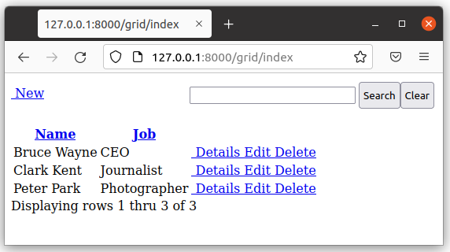
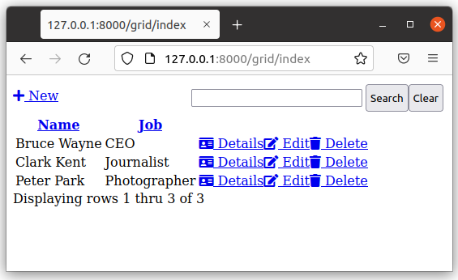
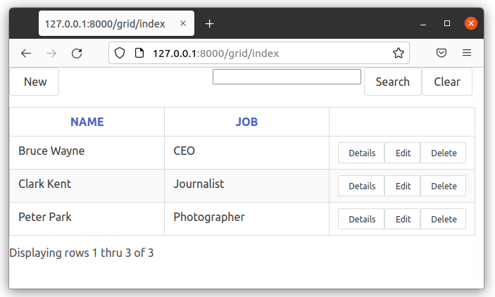
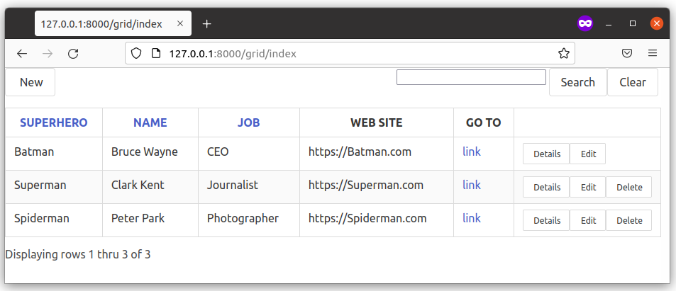

====
Grid
====

py4web comes with a Grid object providing grid and CRUD (create, update and delete) capabilities.
This allows you to quickly and safely provide an interface to your data. Since it's also
highly customizable, it's the corner stone of most py4web's applications.

Key features
------------

-  Full CRUD with Delete Confirmation
-  Click column heads for sorting - click again for DESC
-  Pagination control
-  Built in Search (can use search_queries OR search_form)
-  Action Buttons - with or without text
-  Pre and Post Action (add your own buttons to each row)
-  Grid dates in local format
-  Default formatting by type plus user overrides

.. Hint::

   There is an excellent grid tutorial made by Jim Steil on https://github.com/jpsteil/grid_tutorial.
   You're strongly advised to check it for any doubt and for finding many precious examples,
   hints & tips.

Basic grid example
------------------

In this simple example we will make a grid over the superhero table.

Create a new minimal app called ``grid``. Change it with the following content.

.. code:: python

   # in grid/__init__.py
   import os
   from py4web import action, Field, DAL
   from py4web.utils.grid import *
   from py4web.utils.form import *
   from yatl.helpers import A

   # database definition
   DB_FOLDER = os.path.join(os.path.dirname(__file__), 'databases')
   if not os.path.isdir(DB_FOLDER):
      os.mkdir(DB_FOLDER)
   db = DAL('sqlite://storage.sqlite', folder=DB_FOLDER)
   db.define_table(
      'person',
      Field('superhero'),
      Field('name'),
      Field('job'))

   # add example entries in db
   if not db(db.person).count():
      db.person.insert(superhero='Superman', name='Clark Kent', job='Journalist')
      db.person.insert(superhero='Spiderman', name='Peter Park', job='Photographer')
      db.person.insert(superhero='Batman', name='Bruce Wayne', job='CEO')
      db.commit()

   @action('index', method=['POST', 'GET'])
   @action.uses('grid.html', db)
   def index():
      grid = Grid(
               formstyle=FormStyleDefault, # FormStyleDefault, FormStyleBulma, FormStyleBootstrap4, or FormStyleBootstrap5
               grid_class_style=GridClassStyle, # GridClassStyle or GridClassStyleBulma or GridClassStyleBootstrap5
               icon_style=IconStyleFontawesome, # IconStyle, IconStyleFontawesome, or IconStyleBootstrapIcons
               query=(db.person.id > 0),
               orderby=[db.person.name],
               search_queries=[['Search by Name', lambda val: db.person.name.contains(val)]])

      return dict(grid=grid)

Add a new file templates/grid.html with this basic content:

::

   [[=grid.render()]]

Then restart py4web. If you browse to http://127.0.0.1:8000/grid/index you'll get this
result:

Its layout is quite minimal, but it's perfectly usable.

The main problem is that by default the **no.css** stylesheet is used, see
`here <https://github.com/mdipierro/no.css/>`__. But we've not loaded it!
Change the file templates/grid.html with this content:

::

   <!DOCTYPE html>
   <html>
      <head>
         <link rel="stylesheet" href="https://cdnjs.cloudflare.com/ajax/libs/font-awesome/5.14.0/css/all.min.css"  />
      </head>
      <body>
         [[=grid.render()]]
      <body>
   </html>

Then refresh the page.

This is better now, with proper icons for Details, Edit and Delete actions.

We can also think about using the **bulma.css**, 
see `here <https://bulma.io/>`__. In this case you need to change
the grid object on __init__.py to:

.. code:: python

   formstyle=FormStyleBulma, # FormStyleDefault or FormStyleBulma,FormStyleBootstrap4, or FormStyleBootstrap5
   grid_class_style=GridClassStyleBulma, # GridClassStyle or GridClassStyleBulma or GridClassStyleBootstrap5

Notice that in this case you need to import the corresponding python modules in advance
(we've already done it on line 4 and 5 above). If you use the default no.css style instead,
you don't need to manually import its style modules (and you even don't need the formstyle
and grid_class_style parameters).

You also have to change the file templates/grid.html with this content:

::

   <!DOCTYPE html>
   <html>
      <head>
         <link rel="stylesheet" href="https://cdnjs.cloudflare.com/ajax/libs/bulma/0.9.3/css/bulma.min.css">
      </head>
      <body>
            [[=grid.render()]]
      <body>
   </html>

Then refresh the page.

This is much better, isn't it?

Bootstrap4 and Bootstrap5 also have styles available, and you can change the icon style between
Fontawesome, Bootstrap Icons, and a basic IconStyle you can write your own CSS for. More info in
the section: :ref:`Customizing style`

.. Note::
   These are just minimal examples for showing how ``grid`` works internally.
   Normally you should start from a copy of the standard ``_scaffold`` app, with all
   the Session and Authentication stuff already defined. Also, you should
   follow the standard rules for code, like placing the db definition inside
   models.py and so on.
   Using standards will make your code simpler, safer and more maintainable.

   Also, do not use grid objects directly on the root action of an app, because
   it does not add the 'index' route. So, in this example if you browse to 
   http://127.0.0.1:8000/grid the main page is displayed fine but any contained
   action will lead to a non existent page.

In the :ref:`Advanced topics and examples` chapter you can find
more examples, including a master/detail grid example written with **htmx**.
And don't forget Jim Steil's detailed tutorial on https://github.com/jpsteil/grid_tutorial.

The Grid object
---------------

.. code:: python

   class Grid:
      def __init__(
         self,
         query,
         search_form=None,
         search_queries="auto",
         columns=None,
         field_id=None,
         show_id=None,
         orderby=None,
         left=None,
         headings=None,
         create=True,
         details=True,
         editable=True,
         deletable=True,
         validation=None,
         required_fields=None,
         pre_action_buttons=None,
         post_action_buttons=None,
         auto_process=True,
         rows_per_page=15,
         include_action_button_text=True,
         search_button_text="Filter",
         formstyle=FormStyleDefault,
         grid_class_style=GridClassStyle,
         icon_style=IconStyleFontawesome,
         T=lambda text: text,
         groupby=None,
      ):

-  ``query`` — PyDAL query to be processed.
-  ``search_form`` — py4web ``Form`` to be embedded as the search form.
   If you pass one, you are responsible for applying its filters to
   ``query``. Mutually exclusive with ``search_queries``.
-  ``search_queries`` — list of ``[label, query_factory]`` entries used
   to build the search form automatically. Ignored when
   ``search_form`` is provided. Defaults to ``"auto"``.
-  ``columns`` — list of fields or ``Column`` objects to show on the
   list page (see :ref:`Custom columns`). If blank, all readable
   fields of the queried table are used.
-  ``field_id`` — the id field of the primary table; needed when the
   grid joins multiple tables, to tell the grid which table backs the
   edit/details/delete actions.
-  ``show_id`` — show the primary-key field on the list page.
   Default is ``None`` (auto-detect: shown if a column has type
   ``"id"``).
-  ``orderby`` — PyDAL orderby field or list of fields. Sets the
   default sort order.
-  ``left`` — PyDAL ``left`` expression used when joining tables.
-  ``groupby`` — PyDAL ``groupby`` expression. Used to group rows.
-  ``headings`` — list of column headings; field labels are used when
   missing.
-  ``create`` / ``details`` / ``editable`` / ``deletable`` — control
   the standard action buttons. Each accepts ``True`` (show), ``False``
   (hide), a URL string (use as the redirect target), or a callable
   that receives the current row and returns one of the above.
-  ``validation`` — optional validation callable forwarded to the
   create/edit ``Form``; same contract as ``Form(validation=...)``.
-  ``required_fields`` — list of fields that must always be loaded by
   the underlying query, even if not visible.
-  ``pre_action_buttons`` / ``post_action_buttons`` — lists of action
   buttons rendered before/after the standard action buttons (see
   :ref:`Custom buttons`).
-  ``auto_process`` — when ``True`` (the default) the grid processes
   the request on construction. Set to ``False`` to defer until you
   call ``grid.process()`` yourself.
-  ``rows_per_page`` — number of rows shown per page. Default 15.
-  ``include_action_button_text`` — whether action buttons render
   their text label next to the icon.
-  ``search_button_text`` — text of the submit button on the auto-built
   search form.
-  ``formstyle`` — ``Form`` style class used for the auto-built CRUD
   forms (e.g. ``FormStyleDefault``, ``FormStyleBulma``,
   ``FormStyleBootstrap4``, ``FormStyleBootstrap5``,
   ``FormStyleTailwind``).
-  ``grid_class_style`` — ``GridClassStyle`` subclass used to skin the
   grid (defaults to ``GridClassStyle``; see also
   ``GridClassStyleBulma``, ``GridClassStyleBootstrap5``,
   ``GridClassStyleTailwind``).
-  ``icon_style`` — class used to look up icon CSS classes; built-in
   options are ``IconStyle`` (no icons),
   ``IconStyleFontawesome`` (default) and ``IconStyleBootstrapIcons``.
-  ``T`` — optional translator (typically the ``T`` fixture).

(*) The parameters ``details``, ``editable`` and ``deletable`` can also take a **callable** that will 
be passed the current row of the grid. This is useful because you can then turn a button on or off
depending on the values in the row. In other words,
instead of providing a simple Boolean value you can use an expression like:

.. code:: python

      deletable=lambda row: False if row.job=="CEO" else True,

See also :ref:`Using callable parameters` later on.

Searching and filtering
~~~~~~~~~~~~~~~~~~~~~~~

There are two ways to build a search form:

-  Pass a ``search_queries`` list. Each entry is
   ``[label, query_factory]`` where ``query_factory`` takes the
   submitted search value and returns a PyDAL query. The grid renders
   a search input automatically; if more than one entry is supplied,
   a drop-down lets the user pick which field to search.
-  Build a custom ``search_form`` and pass it to ``Grid``. In this
   case it is your responsibility to apply the form's values back to
   ``query`` before the grid runs.

CRUD settings
~~~~~~~~~~~~~

The grid provides CRUD (create, read, update and delete) capabilities
utilizing py4web Form.
You can turn off CRUD features by setting
create/details/editable/deletable during grid instantiation.

Additionally, you can provide a separate URL to the
create/details/editable/deletable parameters to bypass the
auto-generated CRUD pages and handle the detail pages yourself.

Custom columns
--------------

If the grid does not involve a join but displays results from a single table

.. code:: python

   from py4web.utils.grid import Column
   from yatl.helpers import A

   columns = [
      db.person.id,
      db.person.superhero,
      db.person.name,
      db.person.job,
      Column("Web Site", lambda row: f"https://{row.superhero}.com"),
      Column("Go To", lambda row: A("link", _href=f"https://{row.superhero}.com"))
   ]

   grid = Grid(... columns=columns ...) 

Notice in this example the first columns are regular fields,
The fifth column has a header "Web Site" and consists of URL strings generated from the rows.
The last column has a header "Go To" and generates actual clickable links using the ``A`` helper.
This is the result:

Notice that we've also used the ``deletable`` parameter in order to disable and hide it for
Batman only, as explained before.

.. Warning::

   Do not define columns outside of the controller methods that use them, otherwise the
   structure of the table will change every time the user press the refresh button of the browser!
   
   The reason is that each time the grid displays,
   it modifies the 'columns' variable (in the grid) by adding the action buttons to it. So, if columns are
   defined outside of the controller method, it just keeps adding the actions column.

Using templates
---------------

Display the grid or a CRUD Form

::

   [[=grid.render()]]

You can customize the CRUD form layout like a normal form (see :ref:`Custom forms`). So you can use
the following structure:

::

   [[form = grid.render() ]]
   [[form.custom["begin"] ]]
   ...
   [[form.custom["submit"]
   [[form.custom["end"]

But notice that when handling custom form layouts you need to know if you are displaying
the grid or a form. Use the following to decide:

::

   [[if grid.action in ['details', 'edit']: ]]
       #  Display the custom form
       [[form = grid.render() ]]
       [[form.custom["begin"] ]]
       ...
       [[form.custom["submit"]
       [[form.custom["end"]
   [[else:]]
       [[grid.render() ]]
   [[pass]]

Grid 'path' parameter: Old vs New Usage
---------------------------------------

In previous versions of py4web, the `Grid` object required a `path` parameter in its constructor. This was used to help the grid parse the URL and determine the current action (such as select, edit, details, delete, etc.).

**Old usage example:**

.. code:: python

   grid = Grid(
      path=request.path,
      query=(db.person.id > 0),
      # ...other parameters...
   )

However, starting with py4web 1.20240501 and later, the `path` parameter is no longer needed or supported. The grid now automatically determines the current action and routing from the py4web request context and URL parameters. You should simply omit the `path` argument and use the constructor as follows:

**New usage example:**

.. code:: python

   grid = Grid(
      query=(db.person.id > 0),
      # ...other parameters...
   )

This change makes the API simpler and less error-prone. All routing and action handling is now managed by py4web's @action decorator and the request context, so you do not need to manually pass the path.

If you are updating older code, simply remove the `path` argument from your Grid instantiations.

Grid mode parameter (path replacement)
---------------------------------------

The `Grid` object uses a `mode` variable, which is passed via the `request.query` object in py4web. This variable determines what kind of page or form the grid will render. Possible values for `mode` are:

- `select`: Shows the main grid listing all records (default if not specified).
- `new`: Shows a form to create a new record.
- `details`: Shows a read-only form with details of a single record.
- `edit`: Shows a form to edit an existing record.
- `delete`: Shows a confirmation form to delete a record.

The grid automatically parses the `mode` from the URL query parameters. For example, if you visit `/myapp/mygrid?mode=edit&id=5`, the grid will render the edit form for the record with ID 5. If no `mode` is specified, the grid defaults to `select` and shows the main table view.

If you want to customize navigation or actions, you can generate links or buttons that set the desired `mode` and `id` in the query string.

Customizing style
-------------------

You can provide your own formstyle or grid classes and style to grid.

   forms.
   used for certain portions of the grid.

The default ``GridClassStyle`` - based on **no.css**, primarily uses styles to
modify the layout of the grid. We've already seen that it's possible
to use other class_style, in particular ``GridClassStyleBulma`` or ``GridClassStyleBootstrap5``.

You can even build your own class_style to be used with the css framework of
your choice.

``icon_style`` selects the icon font used for the action buttons.
The classes shipped with py4web are:

- ``IconStyleFontawesome`` (the default) — uses
  `Font Awesome <https://fontawesome.com/>`__ classes such as
  ``fas fa-edit``. You must include the Font Awesome CSS in your
  layout.
- ``IconStyleBootstrapIcons`` — uses
  `Bootstrap Icons <https://icons.getbootstrap.com/#install>`__
  classes such as ``bi bi-pencil-square``. Include the Bootstrap
  Icons CSS in your layout.
- ``IconStyle`` — emits class names like ``icon-edit-button`` so you
  can ship your own icon CSS.

.. _Custom buttons:

Custom action buttons
---------------------

You can add extra buttons to each row in your grid by passing a list
of *button factories* via ``pre_action_buttons`` or
``post_action_buttons``.

A button factory is a callable that receives the current row and
returns either a dictionary or a yatl helper.

The simplest form returns a dictionary:

.. code:: python

   pre_action_buttons = [
       lambda row: dict(
           url=f"https://www.google.com/search?q={row.superhero}",
           text=f"Google for {row.superhero}",
           _style="font-weight: 200",
       )
   ]

   grid = Grid(..., pre_action_buttons=pre_action_buttons)

The dictionary may contain:

- ``url`` — destination URL (required).
- ``text`` — label text (required).
- ``icon`` — optional icon name (e.g. ``"fa-gear"``).
- ``classes`` — extra CSS classes for the button.
- ``kind`` — key used to look up style info in ``GridClassStyle``.
  Defaults to ``"grid-button"``.
- ``_{name}`` — any additional HTML attributes; forwarded to the
  ``A(..., _{name}=...)`` helper that builds the anchor.

For full control, return a yatl helper directly. The helper is
rendered as-is, which avoids the dictionary indirection:

.. code:: python

   from yatl.helpers import A

   pre_action_buttons = [
       lambda row: A(
           f"Google for {row.superhero}",
           _href=f"https://www.google.com/search?q={row.superhero}",
           _style="font-weight: 200",
       )
   ]

   grid = Grid(..., pre_action_buttons=pre_action_buttons)

Using callable parameters
~~~~~~~~~~~~~~~~~~~~~~~~~

The ``create``, ``details``, ``editable`` and ``deletable``
parameters of ``Grid`` accept a callable in addition to ``True`` /
``False`` / a URL string. The callable receives the current row and
returns one of those values, so a button can be turned on or off — or
redirected — based on the row's data:

.. code:: python

   grid = Grid(
       db.employee,
       deletable=lambda row: row.job != "CEO",
       editable=lambda row: URL("custom_edit", row.id) if row.locked
                            else True,
   )

Reference Fields
----------------

When displaying fields in a PyDAL table, you sometimes want to display a
more descriptive field than a foreign key value. There are a couple of
ways to handle that with the py4web grid.

``filter_out`` on PyDAL field definition - here is an example of a foreign
key field

.. code:: python

   Field('company', 'reference company',
         requires=IS_NULL_OR(IS_IN_DB(db, 'company.id',
                                      '%(name)s',
                                      zero='..')),
         filter_out=lambda x: x.name if x else ''),

This will display the company name in the grid instead of the company ID

The downfall of using this method is that sorting and filtering are
based on the company field in the employee table and not the name of the
company

``left join`` — specify fields from a joined table by passing a
``left`` expression to ``Grid``:

.. code:: python

   grid = Grid(
       db.employee,
       left=db.company.on(db.employee.company == db.company.id),
       columns=[db.employee.first_name,
                db.employee.last_name,
                db.company.name],
   )

You can pass any standard PyDAL ``left`` expression, including a list
of joins. The joined column can then be included in ``columns`` and
the user can click the heading to sort by it.

Search queries can also span the join:

.. code:: python

   queries.append(
       db.employee.last_name.contains(search_text)
       | db.employee.first_name.contains(search_text)
       | db.company.name.contains(search_text)
   )

This approach lets you sort and filter, but does not let you combine
fields into one display value the way ``filter_out`` does. Choose the
method that best fits your use case.

Grids with checkboxes
---------------------

While the grid, per se, does not support checkboxes, you can use custom columns to add one or more columns of checkboxes.
You can also add the helpers logic (the grid uses helpers to generate HTML) to wrap it in a ``<form>`` and add one 
or more submit buttons. You can then add logic to process the selected rows when the button is selected. For example:

.. code:: python

   column = Column("select", lambda row: INPUT(_type="checkbox",_name="selected_id",_value=row.id))

   @action("manage")
   @action.uses("manage.html", db)
   def manage():

      grid = Grid(db.thing, columns=[column, db.thing.name])

      # if we are displaying a "select" grid page (not a form)
      if not grid.form:
         grid = grid.render()
         # if checkboxes selection was submitted
         if request.method == "POST":
            # do something with the selected ids
            print("you selected", request.POST.get("selected_id"))
         # inject a ``<form>`` and a ``submit`` button
         grid.children[1:] = [FORM(
               *grid.children[1:],
               DIV(INPUT(_type="submit",_value="do it!")),
               _method="POST",
               _action=request.url)]        
      return locals()

Notice in the above example ``request.POST.get("selected_id")`` can be a single ID (if one selected) or a list of IDs (if more than one
is selected).
