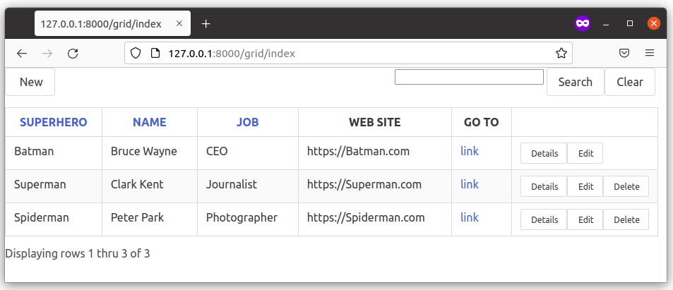

====
Grid
====

py4web comes with a Grid object providing grid and CRUD (create, update and delete) capabilities.
This allows you to quickly and safely provide an interface to your data. Since it's also
highly customizable, it's the corner stone of most py4web's applications.

Key features
------------

-  Full CRUD with Delete Confirmation
-  Click column heads for sorting - click again for DESC
-  Pagination control
-  Built in Search (can use search_queries OR search_form)
-  Action Buttons - with or without text
-  Pre and Post Action (add your own buttons to each row)
-  Grid dates in local format
-  Default formatting by type plus user overrides

.. Hint::

   There is an excellent grid tutorial made by Jim Steil on https://github.com/jpsteil/grid_tutorial.
   You're strongly advised to check it for any doubt and for finding many precious examples,
   hints & tips.

Basic grid example
------------------

In this simple example we will make a grid over the superhero table.

Create a new minimal app called ``grid``. Change it with the following content.

.. code:: python

   # in grid/__init__.py
   import os
   from py4web import action, Field, DAL
   from py4web.utils.grid import *
   from py4web.utils.form import *
   from yatl.helpers import A

   # database definition
   DB_FOLDER = os.path.join(os.path.dirname(__file__), 'databases')
   if not os.path.isdir(DB_FOLDER):
      os.mkdir(DB_FOLDER)
   db = DAL('sqlite://storage.sqlite', folder=DB_FOLDER)
   db.define_table(
      'person',
      Field('superhero'),
      Field('name'),
      Field('job'))

   # add example entries in db
   if not db(db.person).count():
      db.person.insert(superhero='Superman', name='Clark Kent', job='Journalist')
      db.person.insert(superhero='Spiderman', name='Peter Park', job='Photographer')
      db.person.insert(superhero='Batman', name='Bruce Wayne', job='CEO')
      db.commit()

   @action('index', method=['POST', 'GET'])
   @action('index/<path:path>', method=['POST', 'GET'])
   @action.uses('grid.html', db)
   def index(path=None):
      grid = Grid(path,
               formstyle=FormStyleDefault, # FormStyleDefault or FormStyleBulma
               grid_class_style=GridClassStyle, # GridClassStyle or GridClassStyleBulma      
               query=(db.person.id > 0),
               orderby=[db.person.name],
               search_queries=[['Search by Name', lambda val: db.person.name.contains(val)]])

      return dict(grid=grid)

Add a new file templates/grid.html with this basic content:

::

   [[=grid.render()]]

Then restart py4web. If you browse to http://127.0.0.1:8000/grid/index you'll get this
result:

.. image:: images/grid.png

Its layout is quite minimal, but it's perfectly usable.

The main problem is that by default the **no.css** stylesheet is used, see
`here <https://github.com/mdipierro/no.css/>`__. But we've not loaded it!
Change the file templates/grid.html with this content:

::

   <!DOCTYPE html>
   <html>
      <head>
         <link rel="stylesheet" href="https://cdnjs.cloudflare.com/ajax/libs/font-awesome/5.14.0/css/all.min.css"  />
      </head>
      <body>
         [[=grid.render()]]
      <body>
   </html>

Then refresh the page.

.. image:: images/grid_nocss.png

This is better now, with proper icons for Details, Edit and Delete actions.

We can also think about using the **bulma.css**, 
see `here <https://bulma.io/>`__. In this case you need to change
the grid object on __init__.py to:

.. code:: python

   formstyle=FormStyleBulma, # FormStyleDefault or FormStyleBulma
   grid_class_style=GridClassStyleBulma, #GridClassStyle or GridClassStyleBulma

Notice that in this case you need to import the corresponding python modules in advance
(we've already done it on line 4 and 5 above). Instead if you use the default no.css style
you don't need to manually import its style modules (and you even don't need the formstyle
and grid_class_style parameters).

You also have to change the file templates/grid.html with this content:

::

   <!DOCTYPE html>
   <html>
      <head>
         <link rel="stylesheet" href="https://cdnjs.cloudflare.com/ajax/libs/bulma/0.9.3/css/bulma.min.css">
      </head>
      <body>
            [[=grid.render()]]
      <body>
   </html>

Then refresh the page.

.. image:: images/grid_bulmacss.png

This is much better, isn't it?

.. Note::
   These are just minimal examples for showing how ``grid`` works internally.
   Normally you should start from a copy of the standard ``_scaffold`` app, with all
   the Session and Authentication stuff already defined. Also, you should
   follow the standard rules for code, like placing the db definition inside
   models.py and so on.
   Using standards will make your code simpler, safer and more maintainable.

   Also, do not use grid objects directly on the root action of an app, because
   it does not add the 'index' route. So, in this example if you browse to 
   http://127.0.0.1:8000/grid the main page is displayed fine but any contained
   action will lead to a non existent page.

In the :ref:`Advanced topics and examples` chapter you can find
more examples, including a master/detail grid example written with **htmx**.
And don't forget Jim Steil's detailed tutorial on https://github.com/jpsteil/grid_tutorial.

The Grid object
---------------

.. code:: python

   class Grid:
      def __init__(
         self,
         path,
         query,
         search_form=None,
         search_queries=None,
         columns=None,
         field_id=None,
         show_id=False,
         orderby=None,
         left=None,
         headings=None,
         create=True,
         details=True,
         editable=True,
         deletable=True,
         validation=None,
         pre_action_buttons=None,
         post_action_buttons=None,
         auto_process=True,
         rows_per_page=15,
         include_action_button_text=True,
         search_button_text="Filter",
         formstyle=FormStyleDefault,
         grid_class_style=GridClassStyle,
         T=lambda text: text,
      ):

-  path: the route of this request
-  query: pydal query to be processed
-  search_form: py4web FORM to be included as the search form. If
   search_form is passed in then the developer is responsible for
   applying the filter to the query passed in. This differs from
   search_queries
-  search_queries: list of query lists to use to build the search form.
   Ignored if search_form is used
-  columns: list of fields or columns to display on the list page,
   see the :ref:`Custom columns` paragraph later.
   If blank, the table will use all readable fields of the searched table
-  show_id: show the record id field on list page - default = False
-  orderby: pydal orderby field or list of fields
-  left: if joining other tables, specify the pydal left expression here
-  headings: list of headings to be used for list page - if not provided
   use the field label
-  create: URL to redirect to for creating records - set to True to
   automatically generate the URL - set to False to not display the
   button
-  details: URL to redirect to for displaying records - set to True to
   automatically generate the URL - set to False to not display the
   button (*)
-  editable: URL to redirect to for editing records - set to True to
   automatically generate the URL - set to False to not display the
   button (*)
-  deletable: URL to redirect to for deleting records - set to True to
   automatically generate the URL - set to False to not display the
   button (*)
-  validation: optional validation function to pass to create and edit forms
-  pre_action_buttons: list of action_button instances to include before
   the standard action buttons
-  post_action_buttons: list of action_button instances to include after
   the standard action buttons
-  auto_process: Boolean - whether or not the grid should be processed
   immediately. If False, developer must call grid.process() once all
   params are setup
-  rows_per_page: number of rows to display per page. Default 15
-  include_action_button_text: boolean telling the grid whether or not
   you want text on action buttons within your grid
-  search_button_text: text to appear on the submit button on your
   search form
-  formstyle: py4web Form formstyle used to style your form when
   automatically building CRUD forms
-  grid_class_style: GridClassStyle object used to override defaults for
   styling your rendered grid. Allows you to specify classes or styles
   to apply at certain points in the grid
-  T: optional pluralize object

(*) The parameters ``details``, ``editable`` and ``deletable`` can also take a **callable** that will 
be passed the current row of the grid. This is useful because you can then turn a button on or off
depending on the values in the row. In other words,
instead of providing a simple Boolean value you can use an expression like:

.. code:: python

      deletable=lambda row: False if row.job=="CEO" else True,

See also :ref:`Using callable parameters` later on.

Searching and filtering
~~~~~~~~~~~~~~~~~~~~~~~

There are two ways to build a search form:

-  Provide a search_queries list
-  Build your own custom search form

If you provide a search_queries list to grid, it will:

-  build a search form. If more than one search query in the list, it
   will also generate a dropdown to select which search field to search
   against
-  gather filter values and filter the grid

However, if this doesn’t give you enough flexibility you can provide
your own search form and handle all the filtering (building the queries)
by yourself.

CRUD settings
~~~~~~~~~~~~~

The grid provides CRUD (create, read, update and delete) capabilities
utilizing py4web Form.
You can turn off CRUD features by setting
create/details/editable/deletable during grid instantiation.

Additionally, you can provide a separate URL to the
create/details/editable/deletable parameters to bypass the
auto-generated CRUD pages and handle the detail pages yourself.

Custom columns
--------------

If the grid does not involve a join but displays results from a single table
you can specify a list of columns. Columns are highly customizable.

.. code:: python

   from py4web.utils.grid import Column
   from yatl.helpers import A

   columns = [
      db.person.id,
      db.person.superhero,
      db.person.name,
      db.person.job,
      Column("Web Site", lambda row: f"https://{row.superhero}.com"),
      Column("Go To", lambda row: A("link", _href=f"https://{row.superhero}.com"))
   ]

   grid = Grid(... columns=columns ...) 

Notice in this example the first columns are regular fields,
The fifth column has a header "Web Site" and consists of URL strings generated from the rows.
The last column has a header "Go To" and generates actual clickable links using the ``A`` helper.
This is the result:

Notice that we've also used the ``deletable`` parameter in order to disable and hide it for
Batman only, as explained before.

.. Warning::

   Do not define columns outside of the controller methods that use them, otherwise the
   structure of the table will change every time the user press the refresh button of the browser!
   
   The reason is that each time the grid displays,
   it modifies the 'columns' variable (in the grid) by adding the action buttons to it. So, if columns are
   defined outside of the controller method, it just keeps adding the actions column.

Using templates
---------------

Use the following to render your grid or CRUD forms in your templates.

Display the grid or a CRUD Form

::

   [[=grid.render()]]

You can customize the CRUD form layout like a normal form (see :ref:`Custom forms`). So you can use
the following structure:

::

   [[form = grid.render() ]]
   [[form.custom["begin"] ]]
   ...
   [[form.custom["submit"]
   [[form.custom["end"]

But notice that when handling custom form layouts you need to know if you are displaying
the grid or a form. Use the following to decide:

::

   [[if request.query.get('action') in ('details', 'edit'):]]
       #  Display the custom form
       [[form = grid.render() ]]
       [[form.custom["begin"] ]]
       ...
       [[form.custom["submit"]
       [[form.custom["end"]
   [[else:]]
       [[grid.render() ]]
   [[pass]]

Customizing style
-----------------

You can provide your own formstyle or grid classes and style to grid.

-  formstyle is the same as a Form formstyle, used to style the CRUD
   forms.
-  grid_class_style is a class that provides the classes and/or styles
   used for certain portions of the grid.

The default ``GridClassStyle`` - based on **no.css**, primarily uses styles to
modify the layout of the grid. We've already seen that it's possible
to use other class_style, in particular ``GridClassStyleBulma``.

You can even build your own class_style to be used with the css framework of
your choice. Unfortunately, one based on **bootstrap** is still missing.

Custom Action Buttons
---------------------

As with web2py, you can add additional buttons to each row in your grid.
You do this by providing ``pre_action_buttons`` or ``post_action_buttons`` to
the Grid **init** method.

-  ``pre_action_buttons`` - list of action_button instances to include
   before the standard action buttons
-  ``post_action_buttons`` - list of action_button instances to include
   after the standard action buttons

You can build your own Action Button class to pass to pre/post action
buttons based on the template below (this is not provided with py4web).

Sample Action Button Class
~~~~~~~~~~~~~~~~~~~~~~~~~~

.. code:: python

   class GridActionButton:
    def __init__(
        self,
        url,
        text=None,
        icon=None,
        additional_classes="",
        additional_styles="",
        override_classes="",
        override_styles="",
        message="",
        append_id=False,
        name=None,
        ignore_attribute_plugin=False,
        **attrs
    ):
        self.url = url
        self.text = text
        self.icon = icon
        self.additional_classes = additional_classes
        self.additional_styles = additional_styles
        self.override_classes = override_classes
        self.override_styles = override_styles
        self.message = message
        self.append_id = append_id
        self.name = name
        self.ignore_attribute_plugin = ignore_attribute_plugin
        self.attrs = attrs

-  url: the page to navigate to when the button is clicked
-  text: text to display on the button
-  icon: the font-awesome icon to display before the text, for example
   "fa-calendar"
-  additional_classes: a space-separated list of classes to include on
   the button element
-  additional_styles: a string containing additional styles to add to the button
-  override_classes: a space-separated list of classes to place on the control that will replace the default classes
-  override_styles: a string containing the styles to be applied to the control
-  message: confirmation message to display if ‘confirmation’ class is
   added to additional classes
-  append_id: if True, add id_field_name=id_value to the url querystring
   for the button
-  name: the name to apply to the control
-  ignore_attribute_plugin: boolean - respect the attribute plugin specified on the grid or ignore it
-  attrs: additional attributes to apply to the control

After defining the custom GridActionButton class, you need to define
your Action buttons:

.. code:: python

    pre_action_buttons = [
        lambda row: GridActionButton(
            lambda row: f"https://www.google.com/search?q={row.superhero}", 
            text= f"Google for {row.superhero}",
        )
    ]

Finally, you need to reference them in the Grid definition:

.. code:: python

   grid = Grid(... pre_action_buttons = pre_action_buttons  ...) 

Using callable parameters
~~~~~~~~~~~~~~~~~~~~~~~~~

A recent improvement to py4web allows you to pass a **callable** instead of a GridActionButton. This allow you to more easily change the behaviour
of standard and custom Actions.

Callable can be used with:

- details
- editable
- deletable
- additional_classes
- additional_styles
- override_classes
- override_styles

Example usage:

.. code:: python

   @action("example/<path:path>")
   def example(path=None):

       pre_action_buttons = [
           lambda row: GridActionButton(
               URL("test", row.id),
               text="Click me",
               icon="fa-plus",
               additional_classes=row.id,
               additional_styles=["height: 10px" if row.bar else None],
           )
       ]

       post_action_buttons = [
           lambda row: GridActionButton(
               URL("test", row.id),
               text="Click me!!!",
               icon="fa-plus",
               additional_classes=row.id,
               additional_styles=["height: 10px" if row.bar else None],
           )
       ]

       grid = Grid(
           path=path,
           query=db.foo,
           pre_action_buttons=pre_action_buttons,
           post_action_buttons=post_action_buttons,
       )

       return dict(grid=grid.render())

Reference Fields
----------------

When displaying fields in a PyDAL table, you sometimes want to display a
more descriptive field than a foreign key value. There are a couple of
ways to handle that with the py4web grid.

``filter_out`` on PyDAL field definition - here is an example of a foreign
key field

.. code:: python

   Field('company', 'reference company',
         requires=IS_NULL_OR(IS_IN_DB(db, 'company.id',
                                      '%(name)s',
                                      zero='..')),
         filter_out=lambda x: x.name if x else ''),

This will display the company name in the grid instead of the company ID

The downfall of using this method is that sorting and filtering are
based on the company field in the employee table and not the name of the
company

``left join`` and specify fields from joined table - specified on the left
parameter of Grid instantiation

.. code:: python

   db.company.on(db.employee.company == db.company.id)

You can specify a standard PyDAL left join, including a list of joins to
consider.
Now the company name field can be included in your fields list can be
clicked on and sorted.

Also you can specify a query such as:

.. code:: python

   queries.append((db.employee.last_name.contains(search_text)) | (db.employee.first_name.contains(search_text)) | db.company.name.contains(search_text))

This method allows you to sort and filter, but doesn’t allow you to
combine fields to be displayed together as the filter_out method would

You need to determine which method is best for your use case
understanding the different grids in the same application may need to
behave differently.
